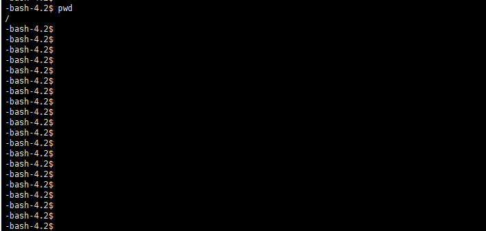

## 什么是chroot
chroot即change root，是linux操作系统的一种文件系统访问隔离技术，通过改变用户/进程的根目录，使得用户/进程只能访问到该目录及其子目录，从而实现访问隔离。

## 使用chroot限制用户的访问权限

1. 创建一个用户test,并设置密码
```bash
useradd test
passwd test
```

2. 为用户test创建根目录/home/test,该目录必须为root用户所有，否则chroot会失败
```bash
mkdir /home/test
chown root:root /home/test
chmod 755 /home/test
```

3. 修改/etc/ssh/sshd_config文件，将test加入到AllowUsers中，并且设置chroot目录为/home/test
```bash
AllowUsers test
Subsystem sftp internal-sftp
Match User test
    ChrootDirectory /home/test
```

4. 重启sshd服务（systemctl不生效的话也可以ps查看进程号直接kill）
```bash
systemctl restart sshd
```

5. chroot创建了一个隔离的文件系统，因此需要安装一些基本的软件包，可以选择从现有系统复制，以bash为例：
```bash
mkdir -p /home/test/{bin,lib,lib32,lib64,usr,sbin,usr/local}
ln -s ../bin /home/test/usr/bin
ln -s ../bin /home/test/usr/local/bin
ln -s ../sbin /home/test/usr/sbin
ln -s ../sbin /home/test/usr/local/sbin
ln -s ../lib /home/test/usr/lib
ln -s ../lib /home/test/usr/local/lib
ln -s ../lib32 /home/test/usr/lib32
ln -s ../lib32 /home/test/usr/local/lib32
ln -s ../lib64 /home/test/usr/lib64
ln -s ../lib64 /home/test/usr/local/lib64
cp /bin/bash /home/test/bin/
cp /usr/local/lib/libreadline.so.6 /home/test/usr/local/lib/
cp /usr/local/lib/libhistory.so.6 /home/test/usr/local/lib/
cp /usr/local/lib/libncurses.so.5 /home/test/usr/local/lib/
cp /usr/local/lib/libdl.so.2 /home/test/usr/local/lib/
cp /usr/local/lib/libc.so.6 /home/test/usr/local/lib/
cp /lib/ld-linux-* /home/test/lib/
cp /bin/ls /home/test/bin/
```

6. 使用test用户登录，可以看到只能访问到/home/test目录，并且无法访问其他目录

