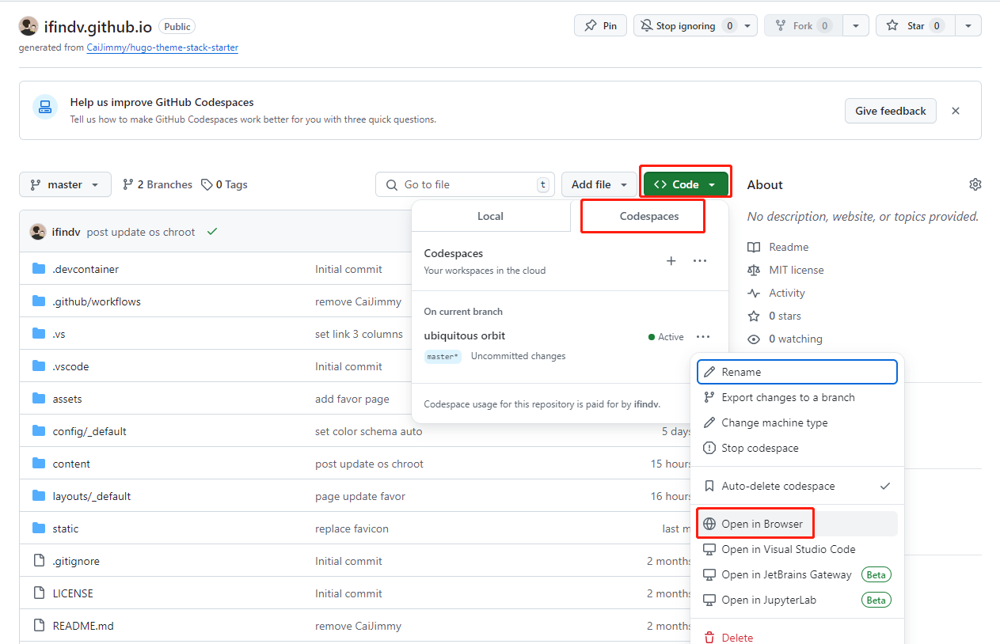
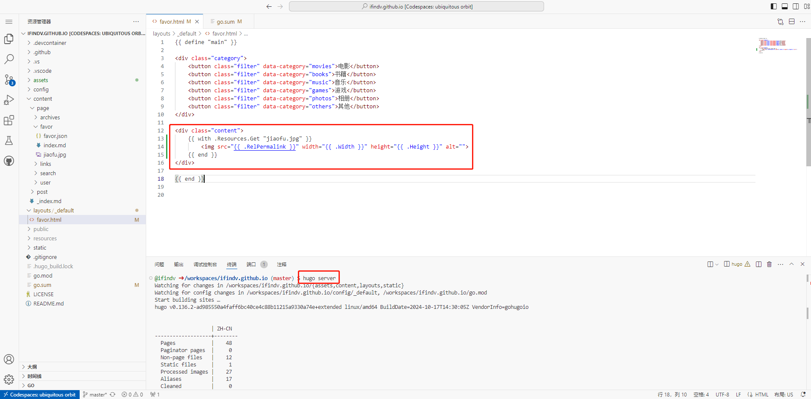

## 技术选型

| 分类 | 选型 | 说明 |
| --- | --- | --- |
| 博客框架 | hugo | 基于GO语言，构建速度快，部署简单 |
| 主题 | stack | 简洁，聚焦内容， [主题地址](https://github.com/CaiJimmy/hugo-theme-stack-starter) |
| 托管服务 | github pages | 0成本 |

## 调试方法

github提供了codespace服务，可以在线调试hugo项目。codespace允许你在浏览器中修改项目代码，并实时预览效果。
 

## 访客统计

umami提供了免费服务，使用方法参考[umami帮助文档](https://umami.is/docs/enable-share-url)
