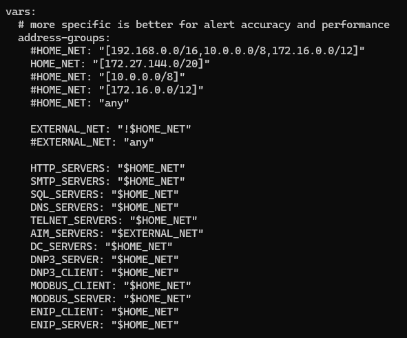
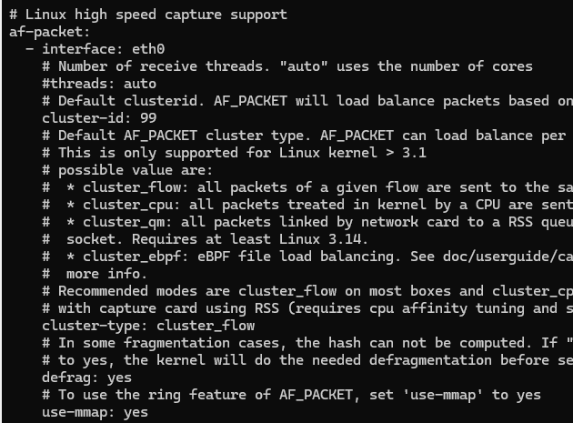
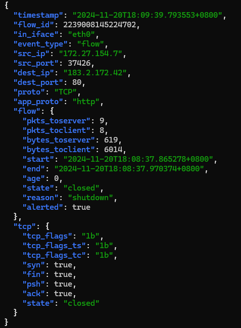
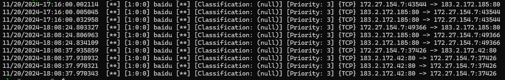
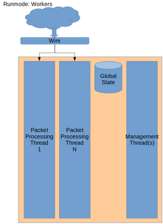
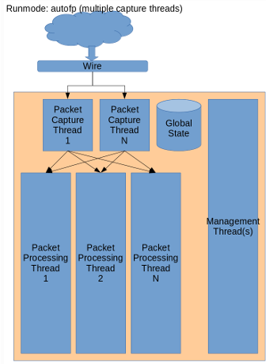
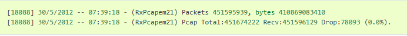

## 简介

> Suricata is a high performance, open source network analysis and threat detection software used by most private and public organizations, and embedded by major vendors to protect their assets.

- [官网](https://suricata.io/)
- [官方文档](https://docs.suricata.io/en/latest/index.html#)
- [源代码](https://github.com/OISF/suricata)
- [官方社区](https://forum.suricata.io/)

## 快速开始

### 安装

debian系统，直接使用apt安装即可（其它系统参考官方文档第3部分installation）：

```bash
sudo apt install suricata
```

### 配置

基础配置只需关注HOME_NET与interface两个参数即可（详细配置参考官方文档第12章），其中HOME_NET为本地网络地址，interface为监听的网络接口。配置文件路径为/etc/suricata/suricata.yaml，
示例如下：

 

规则（suricata中称为signatures）保存在/etc/suricata/rules/目录下，可以通过suricata-update命令更新。当然，也可以手动新建规则文件（比如用于测试）：

```bash
sudo touch /etc/suricata/rules/suricata.rules
sudo echo 'alert ip any any -> any any (msg: "baidu"; content: "baidu"; )' > /etc/suricata/rules/suricata.rules
```

### 启动

可以使用命令行直接起前台，或者通过service/systemd启动后台服务（后台启动需要先将/etc/default/suricata文件中的RUN改为yes，否则会报错）。

```bash
sudo suricata -c /etc/suricata/suricata.yaml -i eth0
```

### 测试

事件日志/var/log/suricata/eve.json(使用event_type标识事件类型，常见的像统计stats、告警alert、流flow等，记录非常详细)，告警日志/var/log/suricata/fast.log，可以使用curl进行测试(比如curl www.baidu.com)，日志示例如下：

 

也可以通过报文回放进行测试，使用-r FILE.pcap指定要回放的pcap文件。

## 规则

### 格式

一条规则由3个部分组成，分别是action、header、rule options，示例如下：

```bash
alert http $HOME_NET any -> $EXTERNAL_NET any (msg:"HTTP GET Request Containing Rule in URI"; flow:established,to_server; http.method; content:"GET"; http.uri; content:"rule"; fast_pattern; classtype:bad-unknown; sid:123; rev:1;)
```

动作定义规则匹配时做什么，header定义规则的协议、IP、端口、方向等信息（网络层、传输层、应用层协议），rule options定义规则的细节（应用层数据）。

### 关键字

本部分介绍suricata元关键字（称为Meta Keywords），其它关键字（涉及协议细节）请参考官方文档第8部分。

| 关键字 | 说明 | 示例 |
|:---:|:---:|:---:|
| msg | 告警信息 | msg:"HTTP GET Request Containing Rule in URI", 该字段应该写在最前，各部分首字母大写，最好能反映规则的类型 |
| sid | 规则ID | sid:123 |
| rev | 规则版本 | rev:1 |
| gid | 规则组ID | gid:1，告警记录[gid:sid:rev] |
| classtype | 告警类型 | classtype:bad-unknown，该字段应该写在sid与rev之前 |
| reference | 参考信息 | reference:cve,2024-1234，规则的来源以及解决的问题 |
| priority | 规则优先级 | priority:1，最高为1，取值1~255, 一般使用1~4即可 |
| metadata | 元数据 | metadata:created_at,2024_01_01,metadata:created_by,xxx，用于附加一些功能无关的信息 |
| target | 目标 | target:[src_ip|dest_ip]，说明告警记录中哪个IP是攻击目标 |
| requires | 依赖 | requires: feature geoip, version >= 7.0.0, 用于指定规则依赖的模块以及版本，不符合依赖条件的规则会被忽略 |

## 性能

### 运行模式

suricata采用(多)线程模型，每个线程可以包含多个功能模块（比如decode、detect、output），多个线程之间通过queue来传递报文。suricata支持的运行模式有：

- workers: 多个线程，每个线程都是一个完整的流水线，默认模式。
- single: workers的特例，只有一个线程，多用于开发调试。
- autofp: 多个线程，线程分为Capture和Processing两种，通过queue传递报文。

 

### 负载均衡

可以在抓包模块实现负载均衡算法（通过软件hash计算将报文分发到不同的worker），或者通过网卡硬件的RSS（Receive Side Scaling）功能，将报文分发到不同的队列（worker）。
硬件卸载功能必须关闭，以防止报文某些特征被破坏影响检测。典型的像LRO/GRO会导致小包合并成大的super packet，从而影响dsize关键字的检测以及TCP状态跟踪。
若使用AF_PACKET或PF_RING抓包，checksum卸载功能可以保持开启。

### 性能调优

- max-pending-packets: 引擎可以同时处理的报文数，数值越高，线程越繁忙，内存消耗越大。经验值10000~65000，所需内存计算公式number_of.threads X max-pending-packets X (default-packet-size + ~750 bytes)
- mpm-algo: 多模式匹配算法，支持ac,hs,ac-bc,ac-ks, hs性能最高但对平台有要求，ac-ks次之, ac相对较低。
- detect.profile: 规则分组数，数值越高检测性能越高，内存消耗小幅增加，支持low, medium, high, custom, 默认为high。
- detect.sgh-mpm-context: 多模式匹配上下文大小，根据选择的mpm-algo自动调整，一般无需修改。
- af-packet: IDS/NSM推荐使用v3，IPS推荐使用v2。
- ring-size: 队列大小，内存消耗计算公式af-packet.threads X af-packet.ring-size X (default-packet-size + ~750 bytes)。
- stream-bypass: 设定flow的ressembly depth，比如1mb，超过的部分跳过检测（针对某些特殊的流）。


### NIC/CPU配置

不同的厂商和型号支持的特性不同，具体参考官方文档第11.5章节。

### 统计

统计信息以固定的周期输出，默认间隔8秒，可以用于检查suricata的运行状况，suricata退出时会输出丢包统计信息。


网卡的统计信息可以使用ethtool命令查看，比如：
```
# ethtool -S em2
NIC statistics:
     rx_packets: 35430208463
     tx_packets: 216072
     rx_bytes: 32454370137414
     tx_bytes: 53624450
     rx_broadcast: 17424355
     tx_broadcast: 133508
     rx_multicast: 5332175
     tx_multicast: 82564
     rx_errors: 47
     tx_errors: 0
     tx_dropped: 0
     ...
```

另外可以通过stats.log查看kernel的丢包信息。

### 过滤

借助于BPF，suricata可以过滤某些特定的流量，只对感兴趣的流进行检测。可以通过命令行直接运行，或者通过配置文件指定过滤规则。举例如下：

```
suricata -i eth0 -v not host 1.2.3.4
suricata -i eno1 -c suricata.yaml tcp or udp
suricata -i ens5f0 -F capture-filter.bpf
```

### 抑制

supress规则用于抑制某些特定的告警，比如某个特定的host不产生告警。举例如下：

```
suppress gen_id 0, sig_id 0, track by_src, ip 1.2.3.4
```

### 加密流绕过

对于像TLS这种加密流量，suricata可以配置在握手结束后，跳过后续加密流的检测，通过app-layer.protocols.tls.encryption-handling进行设置。

### Tcmalloc

google公司研发的性能优化内存分配器，可以小幅提升性能，同时节约一部分内存。使用方法如下：

```
LD_PRELOAD="/usr/lib64/libtcmalloc_minimal.so.4" suricata -c suricata.yaml -i eth0
```

## 开发

### 源码编译 & 安装

从github下载源码，[suricata-suricata-7.0.7.zip](https://codeload.github.com/OISF/suricata/zip/refs/tags/suricata-7.0.7)与[libhtp-0.5.49.zip](https://codeload.github.com/OISF/libhtp/zip/refs/tags/0.5.49)。放在同级目录下，执行命令（以Debian为例）：

```
sudo apt -y install autoconf automake build-essential cargo \
    cbindgen libjansson-dev libpcap-dev libpcre2-dev libtool \
    libyaml-dev make pkg-config rustc zlib1g-dev libnuma-dev dpdk-dev git liblua5.1-dev libmaxminddb-dev \
    libcap-ng-dev libmagic-dev liblz4-dev libunwind-dev

unzip libhtp-0.5.49.zip
unzip suricata-suricata-7.0.7.zip
cd suricata-suricata-7.0.7
mv ../libhtp-0.5.49 libhtp
./libhtp/autogen.sh
./libhtp/configure --prefix=/usr
./autogen.sh
./configure --prefix=/usr --sysconfdir=/etc --localstatedir=/var --enable-lua --enable-geoip --enable-dpdk
make
make install
```

安装完成执行suricata -V可查看版本信息。

### suricata library

suricata当前还不支持以动态库的形式直接集成到APP中（APP已经具备收发包功能，只利用suricata做检测）。官方回复正在推进中，预计8.0之后的某个版本会支持。
花了一周多的时间尝试在7.0.2版本基础上封装动态库，测试基础功能可用（因精力有限尚未做详尽的测试），项目地址[suricata-lib](https://github.com/ifindv/suricata-lib)
可供参考。
