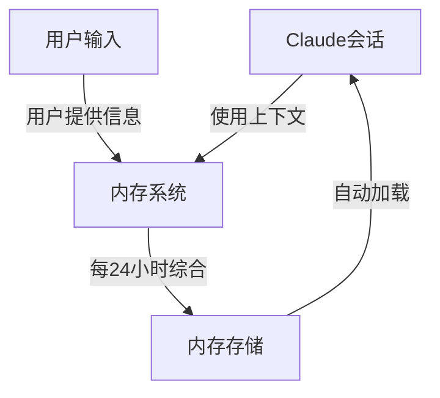
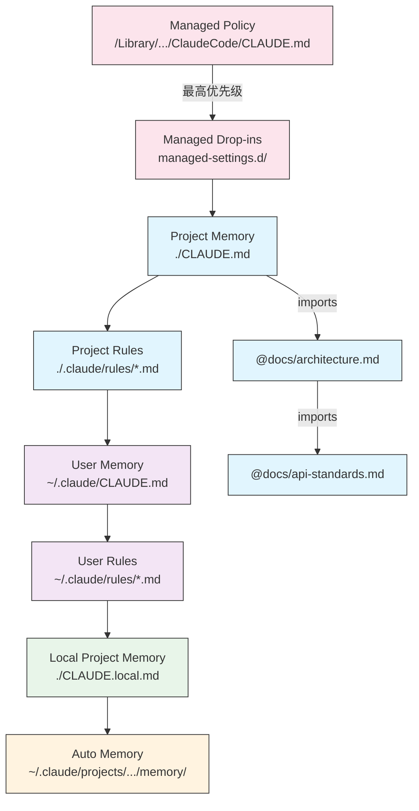
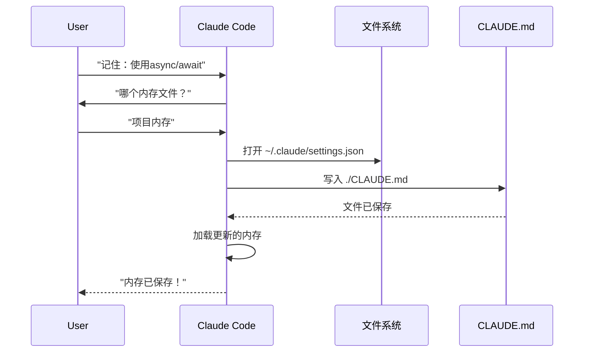
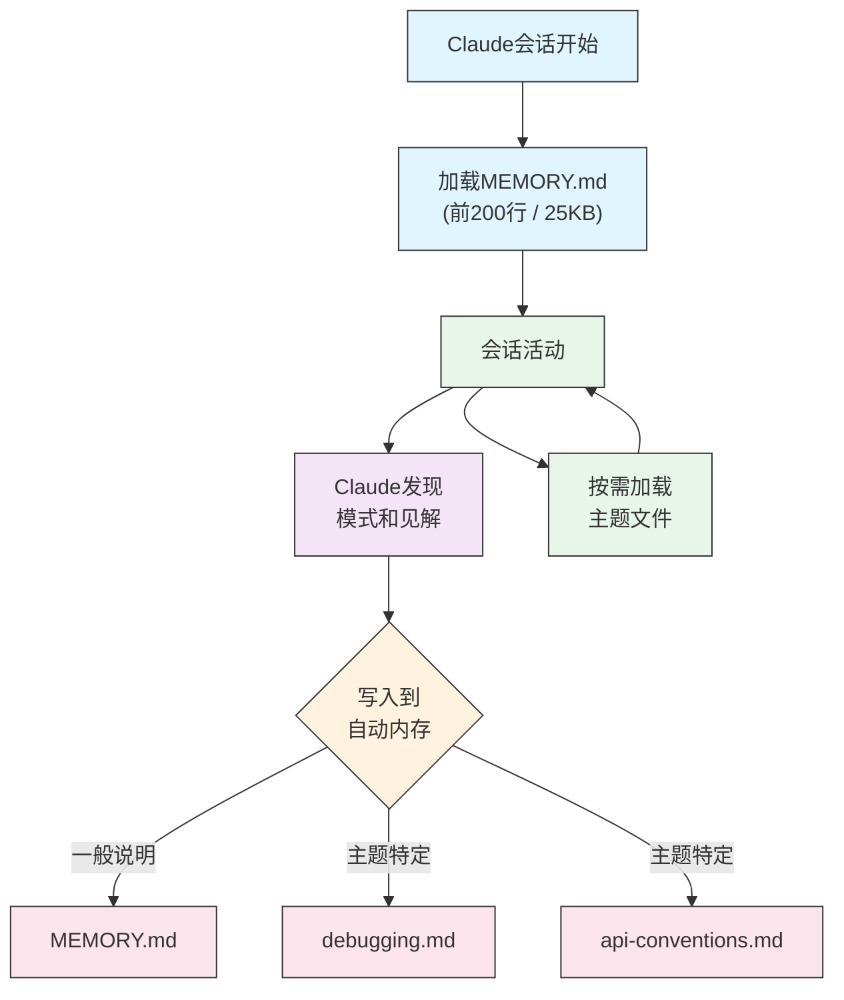

内存系统使Claude能够在多个会话和对话中保持持久化的上下文。与临时上下文窗口不同，内存文件允许你在团队间共享项目标准、存储个人开发偏好、维护特定目录的规则，并将外部文档导入为版本控制的一部分。

## 核心概念

### 什么是内存系统？

内存系统在Claude Code中提供跨多个会话和对话的持久化上下文。内存文件允许你：

- 在团队间共享项目标准
- 存储个人开发偏好
- 维护目录特定的规则和配置
- 导入外部文档
- 将内存作为项目的一部分进行版本控制

内存系统在多个层级运行，从全局个人偏好到特定子目录，允许对Claude记忆内容和应用方式进行精细控制。

### 内存命令快速参考

| 命令 | 用途 | 使用 | 何时使用 |
|------|------|------|----------|
| `/init` | 初始化项目内存 | `/init` | 开始新项目，首次设置CLAUDE.md |
| `/memory` | 在编辑器中编辑内存文件 | `/memory` | 大量更新、重组、审查内容 |
| `#` prefix | ~~快速单行内存添加~~ **已弃用** | — | 改用`/memory`或对话式询问 |
| `@path/to/file` | 导入外部内容 | `@README.md`或`@docs/api.md` | 在CLAUDE.md中引用现有文档 |

## 快速开始：初始化内存

### `/init`命令

`/init`命令是在Claude Code中设置项目内存的最快方式。它初始化一个具有基础项目文档的CLAUDE.md文件。

**使用：**

```bash
/init
```

**它的作用：**

- 在你的项目中创建一个新的CLAUDE.md文件（通常在`./CLAUDE.md`或`./.claude/CLAUDE.md`）
- 建立项目约定和指南
- 为跨会话的上下文持久化设置基础
- 提供记录项目标准的模板结构

**增强交互模式：**设置`CLAUDE_CODE_NEW_INIT=1`以启用多阶段交互式流程，逐步引导你完成项目设置：

```bash
CLAUDE_CODE_NEW_INIT=1 claude
/init
```

**何时使用`/init`：**

- 用Claude Code开始新项目
- 建立团队编码标准和约定
- 创建关于代码库结构的文档
- 为协作开发设置内存层级

### 快速内存更新

> **注意**：用于内联内存的`#`快捷方式已弃用。使用`/memory`直接编辑内存文件，或对话式要求Claude记住某些内容（例如，"记住我们在该项目中总是使用TypeScript严格模式"）。

添加信息到内存的推荐方式：

**选项1：使用`/memory`命令**

```bash
/memory
```

在你的系统编辑器中打开内存文件以进行直接编辑。

**选项2：对话式询问**

```
记住我们在该项目中总是使用TypeScript严格模式。
请添加到内存中：比起promise链更喜欢使用async/await。
```

Claude将根据你的请求更新适当的CLAUDE.md文件。

**历史参考**（不再有效）：

`#`前缀快捷方式之前允许内联添加规则：

```markdown
# 在该项目中总是使用TypeScript严格模式  ← 不再有效
```

如果你依赖此模式，切换到`/memory`命令或对话式请求。

### `/memory`命令

`/memory`命令在Claude Code会话中提供直接编辑CLAUDE.md内存文件的访问。它在你的系统默认编辑器中打开你的内存文件以进行全面编辑。

**使用：**

```bash
/memory
```

**它的作用：**

- 在你的系统默认编辑器中打开你的内存文件
- 允许你进行大量添加、修改和重组
- 提供对层级中所有内存文件的直接访问
- 使你能够管理跨会话的持久化上下文

**何时使用`/memory`：**

- 审查现有内存内容
- 对项目标准进行大量更新
- 重组内存结构
- 添加详细文档或指南
- 随项目发展维护和更新内存

**比较：`/memory` vs `/init`**

| 方面 | `/memory` | `/init` |
|--------|-----------|---------|
| **目的** | 编辑现有内存文件 | 初始化新CLAUDE.md |
| **何时使用** | 更新/修改项目上下文 | 开始新项目 |
| **操作** | 打开编辑器进行更改 | 生成起始模板 |
| **工作流** | 持续维护 | 一次性设置 |

### 使用内存导入

CLAUDE.md文件支持`@path/to/file`语法来包含外部内容：

```markdown
# 项目文档
见@README.md了解项目概览
见@package.json了解可用的npm命令
见@docs/architecture.md了解系统设计

# 使用绝对路径从主目录导入
@~/.claude/my-project-instructions.md
```

**导入特性：**

- 支持相对路径和绝对路径（例如，`@docs/api.md`或`@~/.claude/my-project-instructions.md`）
- 支持递归导入，最大深度为5
- 首次从外部位置导入时触发批准对话框以确保安全
- 不会在markdown代码跨距或代码块中评估导入指令（因此在示例中记录它们是安全的）
- 通过引用现有文档帮助避免重复
- 自动将引用内容包含在Claude的上下文中

## 内存架构

Claude Code中的内存遵循分层系统，其中不同作用域服务于不同目的：



### Claude Code中的内存层级

Claude Code使用多层分层内存系统。当Claude Code启动时，内存文件自动加载，更高层级的文件具有优先权：

**完整内存层级（按优先级顺序）：**

1. **Managed Policy** - 组织范围指令
   - macOS: `/Library/Application Support/ClaudeCode/CLAUDE.md`
   - Linux/WSL: `/etc/claude-code/CLAUDE.md`
   - Windows: `C:\Program Files\ClaudeCode\CLAUDE.md`

2. **Managed Drop-ins** - 字母顺序合并的策略文件（v2.1.83+）
   - 策略CLAUDE.md旁边的`managed-settings.d/`目录
   - 文件按字母顺序合并以实现模块化策略管理

3. **Project Memory** - 团队共享上下文（版本控制）
   - `./.claude/CLAUDE.md`或`./CLAUDE.md`（在存储库根目录）

4. **Project Rules** - 模块化、特定主题的项目指令
   - `./.claude/rules/*.md`

5. **User Memory** - 个人偏好（所有项目）
   - `~/.claude/CLAUDE.md`

6. **User-Level Rules** - 个人规则（所有项目）
   - `~/.claude/rules/*.md`

7. **Local Project Memory** - 个人项目特定偏好
   - `./CLAUDE.local.md`

> **注意**：`CLAUDE.local.md`完全受支持并在[官方文档](https://code.claude.com/docs/en/memory)中有记录。它提供未提交到版本控制的个人项目特定偏好。将`CLAUDE.local.md`添加到你的`.gitignore`。

8. **Auto Memory** - Claude的自动记录和学习
   - `~/.claude/projects/<project>/memory/`

**内存发现行为：**

Claude按此顺序搜索内存文件，较早的位置优先：



### 使用`claudeMdExcludes`排除CLAUDE.md文件

在大型monorepo中，某些CLAUDE.md文件可能与你的当前工作无关。`claudeMdExcludes`设置允许你跳过特定的CLAUDE.md文件，使其不会加载到上下文中：

```jsonc
// 在 ~/.claude/settings.json 或 .claude/settings.json 中
{
  "claudeMdExcludes": [
    "packages/legacy-app/CLAUDE.md",
    "vendors/**/CLAUDE.md"
  ]
}
```

模式相对于项目根目录匹配。这对于以下情况特别有用：

- 包含许多子项目的monorepo，其中只有一些是相关的
- 包含供应商或第三方CLAUDE.md文件的存储库
- 通过排除陈旧或不相关的指令来减少Claude上下文窗口中的噪音

### 设置文件层级

Claude Code设置（包括`autoMemoryDirectory`、`claudeMdExcludes`和其他配置）从五级层级解析，较高级别优先：

| 级别 | 位置 | 作用域 |
|------|------|-------|
| 1 (最高) | Managed policy (系统级) | 组织范围执行 |
| 2 | `managed-settings.d/` (v2.1.83+) | 模块化策略drop-ins，按字母顺序合并 |
| 3 | `~/.claude/settings.json` | 用户偏好 |
| 4 | `.claude/settings.json` | 项目级（提交到git） |
| 5 (最低) | `.claude/settings.local.json` | 本地覆盖（git-ignored） |

**平台特定配置（v2.1.51+）：**

设置也可以通过以下方式配置：
- **macOS**：属性列表（plist）文件
- **Windows**：Windows注册表

这些平台原生机制与JSON设置文件一起读取，并遵循相同的优先级规则。

### 模块化规则系统

使用`.claude/rules/`目录结构创建有组织的、路径特定的规则。规则可以在项目级别和用户级别定义：

```
your-project/
├── .claude/
│   ├── CLAUDE.md
│   └── rules/
│       ├── code-style.md
│       ├── testing.md
│       ├── security.md
│       └── api/                  # 支持子目录
│           ├── conventions.md
│           └── validation.md

~/.claude/
├── CLAUDE.md
└── rules/                        # 用户级规则（所有项目）
    ├── personal-style.md
    └── preferred-patterns.md
```

规则在`rules/`目录内递归发现，包括任何子目录。`~/.claude/rules/`处的用户级规则在项目级规则之前加载，允许项目可以覆盖的个人默认值。

### 使用YAML Frontmatter的路径特定规则

定义仅适用于特定文件路径的规则：

```markdown
---
paths: src/api/**/*.ts
---

# API开发规则

- 所有API端点必须包含输入验证
- 使用Zod进行架构验证
- 记录所有参数和响应类型
- 为所有操作包含错误处理
```

**Glob模式示例：**

- `**/*.ts` - 所有TypeScript文件
- `src/**/*` - src/下的所有文件
- `src/**/*.{ts,tsx}` - 多种扩展名
- `{src,lib}/**/*.ts, tests/**/*.test.ts` - 多种模式

### 子目录和符号链接

`.claude/rules/`中的规则支持两个组织特性：

- **子目录**：规则递归发现，因此你可以将它们组织到基于主题的文件夹中（例如，`rules/api/`、`rules/testing/`、`rules/security/`）
- **符号链接**：支持符号链接以在多个项目之间共享规则。例如，你可以将共享规则文件从中心位置符号链接到每个项目的`.claude/rules/`目录

### 内存位置表

| 位置 | 作用域 | 优先级 | 共享 | 访问 | 最适合 |
|----------|-------|----------|--------|--------|----------|
| `/Library/Application Support/ClaudeCode/CLAUDE.md` (macOS) | Managed Policy | 1 (最高) | 组织 | 系统 | 公司范围策略 |
| `/etc/claude-code/CLAUDE.md` (Linux/WSL) | Managed Policy | 1 (最高) | 组织 | 系统 | 组织标准 |
| `C:\Program Files\ClaudeCode\CLAUDE.md` (Windows) | Managed Policy | 1 (最高) | 组织 | 系统 | 公司指南 |
| `managed-settings.d/*.md` (策略旁边) | Managed Drop-ins | 1.5 | 组织 | 系统 | 模块化策略文件（v2.1.83+） |
| `./CLAUDE.md`或`./.claude/CLAUDE.md` | Project Memory | 2 | 团队 | Git | 团队标准、共享架构 |
| `./.claude/rules/*.md` | Project Rules | 3 | 团队 | Git | 路径特定、模块化规则 |
| `~/.claude/CLAUDE.md` | User Memory | 4 | 个人 | 文件系统 | 个人偏好（所有项目） |
| `~/.claude/rules/*.md` | User Rules | 5 | 个人 | 文件系统 | 个人规则（所有项目） |
| `./CLAUDE.local.md` | Project Local | 6 | 个人 | Git (忽略) | 个人项目特定偏好 |
| `~/.claude/projects/<project>/memory/` | Auto Memory | 7 (最低) | 个人 | 文件系统 | Claude的自动记录和学习 |

### 内存更新生命周期

内存更新在你的Claude Code会话中如何流转：



### 自动内存

自动内存是一个持久化目录，Claude在处理项目时自动记录学习、模式和见解。与手动编写和维护的CLAUDE.md文件不同，自动内存由Claude本身在会话期间编写。

### 自动内存的工作原理

- **位置**：`~/.claude/projects/<project>/memory/`
- **入口点**：`MEMORY.md`是自动内存目录中的主文件
- **主题文件**：用于特定主题的可选附加文件（例如，`debugging.md`、`api-conventions.md`）
- **加载行为**：`MEMORY.md`的前200行（或前25KB，以先到者为准）在会话开始时加载到上下文中。主题文件按需加载，不在启动时加载
- **读/写**：Claude在会话期间读写内存文件，因为它发现模式和项目特定知识

### 自动内存架构



### 自动内存目录结构

```
~/.claude/projects/<project>/memory/
├── MEMORY.md              # 入口点（前200行 / 25KB在启动时加载）
├── debugging.md           # 主题文件（按需加载）
├── api-conventions.md     # 主题文件（按需加载）
└── testing-patterns.md    # 主题文件（按需加载）
```

### 版本要求

自动内存需要**Claude Code v2.1.59或更高版本**。如果你使用的是旧版本，请先升级：

```bash
npm install -g @anthropic-ai/claude-code@latest
```

### 自定义自动内存目录

默认情况下，自动内存存储在`~/.claude/projects/<project>/memory/`中。你可以使用`autoMemoryDirectory`设置更改此位置（自**v2.1.74**起可用）：

```jsonc
// 在 ~/.claude/settings.json 或 .claude/settings.local.json（仅用户/本地设置）中
{
  "autoMemoryDirectory": "/path/to/custom/memory/directory"
}
```

> **注意**：`autoMemoryDirectory`只能在用户级（`~/.claude/settings.json`）或本地设置（`.claude/settings.local.json`）中设置，而不能在项目或策略设置中。

当你想要以下情况时，这很有用：

- 将自动内存存储在共享或同步位置
- 将自动内存与默认Claude配置目录分开
- 使用默认层级之外的项目特定路径

### Worktree和存储库共享

同一git存储库中的所有worktree和子目录共享单个自动内存目录。这意味着在worktree之间切换或在同一存储库的不同子目录中工作将读取和写入相同的内存文件。

### 子代理内存

子代理（通过Task工具或并行执行生成）可以有自己的内存上下文。使用子代理定义中的`memory` frontmatter字段指定要加载的内存作用域：

```yaml
memory: user      # 仅加载用户级内存
memory: project   # 仅加载项目级内存
memory: local     # 仅加载本地内存
```

这允许子代理以聚焦的上下文操作，而不是继承完整的内存层级。

> **注意**：子代理也可以维护自己的自动内存。有关详细信息，请参阅[官方子代理内存文档](https://code.claude.com/docs/en/sub-agents#enable-persistent-memory)。

### 控制自动内存

自动内存可以通过`CLAUDE_CODE_DISABLE_AUTO_MEMORY`环境变量控制：

| 值 | 行为 |
|------|------|
| `0` | 强制自动内存**开启** |
| `1` | 强制自动内存**关闭** |
| *(未设置)* | 默认行为（自动内存启用） |

```bash
# 为会话禁用自动内存
CLAUDE_CODE_DISABLE_AUTO_MEMORY=1 claude

# 显式强制开启自动内存
CLAUDE_CODE_DISABLE_AUTO_MEMORY=0 claude
```

### 使用`--add-dir`的附加目录

`--add-dir`标志允许Claude Code从当前工作目录之外的其他目录加载CLAUDE.md文件。这对于monorepo或多项目设置很有用，其中其他目录的上下文是相关的。

要启用此功能，设置环境变量：

```bash
CLAUDE_CODE_ADDITIONAL_DIRECTORIES_CLAUDE_MD=1
```

然后用标志启动Claude Code：

```bash
claude --add-dir /path/to/other/project
```

Claude将从指定的附加目录加载CLAUDE.md，与当前工作目录的内存文件一起。

## 实用示例

### 示例1：项目内存结构

**文件：**`./CLAUDE.md`

```markdown
# 项目配置

## 项目概览
- **名称**：电商交易平台
- **技术栈**：Node.js、PostgreSQL、React 18、Docker
- **团队规模**：5名开发者
- **截止日期**：2025年第四季度

## 架构
@docs/architecture.md
@docs/api-standards.md
@docs/database-schema.md

## 开发标准

### 代码风格
- 使用Prettier进行格式化
- 使用ESLint和airbnb配置
- 最大行长度：100字符
- 使用2空格缩进

### 命名约定
- **文件**：kebab-case (user-controller.js)
- **类**：PascalCase (UserService)
- **函数/变量**：camelCase (getUserById)
- **常量**：UPPER_SNAKE_CASE (API_BASE_URL)
- **数据库表**：snake_case (user_accounts)

### Git工作流
- 分支命名：`feature/描述`或`fix/描述`
- 提交消息：遵循conventional commits
- 合并前需要PR
- 所有CI/CD检查必须通过
- 至少需要1个批准

### 测试要求
- 最低80%代码覆盖率
- 所有关键路径必须有测试
- 使用Jest进行单元测试
- 使用Cypress进行E2E测试
- 测试文件名：`*.test.ts`或`*.spec.ts`

### API标准
- 仅限RESTful端点
- JSON请求/响应
- 正确使用HTTP状态码
- 版本化API端点：`/api/v1/`
- 用示例记录所有端点

### 数据库
- 使用迁移进行架构更改
- 永不硬编码凭据
- 使用连接池
- 在开发中启用查询日志
- 需要定期备份

### 部署
- 基于Docker的部署
- Kubernetes编排
- 蓝绿部署策略
- 失败时自动回滚
- 部署前运行数据库迁移

## 常用命令

| 命令 | 用途 |
|------|------|
| `npm run dev` | 启动开发服务器 |
| `npm test` | 运行测试套件 |
| `npm run lint` | 检查代码风格 |
| `npm run build` | 构建生产版本 |
| `npm run migrate` | 运行数据库迁移 |

## 团队联系
- 技术主管：Sarah Chen (@sarah.chen)
- 产品经理：Mike Johnson (@mike.j)
- DevOps：Alex Kim (@alex.k)

## 已知问题和解决方法
- 高峰时段PostgreSQL连接池限制为20
- 解决方法：实现查询队列
- Safari 14与async生成器兼容性问题
- 解决方法：使用Babel转译器

## 相关项目
- 分析仪表板：`/projects/analytics`
- 移动应用：`/projects/mobile`
- 管理面板：`/projects/admin`
```

### 示例2：目录特定内存

**文件：**`./src/api/CLAUDE.md`

````markdown
# API模块标准

此文件为/src/api/中的所有内容覆盖根CLAUDE.md。

## API特定标准

### 请求验证
- 使用Zod进行架构验证
- 始终验证输入
- 返回400及验证错误
- 包含字段级错误详情

### 认证
- 所有端点需要JWT令牌
- 令牌在Authorization标头中
- 令牌24小时后过期
- 实现刷新令牌机制

### 响应格式

所有响应必须遵循此结构：

```json
{
  "success": true,
  "data": { /* 实际数据 */ },
  "timestamp": "2025-11-06T10:30:00Z",
  "version": "1.0"
}
```

错误响应：
```json
{
  "success": false,
  "error": {
    "code": "VALIDATION_ERROR",
    "message": "用户消息",
    "details": { /* 字段错误 */ }
  },
  "timestamp": "2025-11-06T10:30:00Z"
}
```

### 分页
- 使用基于游标的分页（不是偏移）
- 包含`hasMore`布尔值
- 限制最大页面大小为100
- 默认页面大小：20

### 速率限制
- 认证用户每小时1000个请求
- 公共端点每小时100个请求
- 超限时返回429
- 包含retry-after标头

### 缓存
- 使用Redis进行会话缓存
- 缓存持续时间：默认5分钟
- 在写操作时使缓存失效
- 用资源类型标记缓存键
````

### 示例3：个人偏好

**文件：**`~/.claude/CLAUDE.md`

```markdown
# 我的开发偏好

## 关于我
- **经验水平**：8年全栈开发经验
- **偏好语言**：TypeScript、Python
- **沟通风格**：直接，附示例
- **学习风格**：带代码的视觉图表

## 代码偏好

### 错误处理
我偏好使用带有try-catch块和有意义错误消息的显式错误处理。
避免通用错误。始终记录错误以便调试。

### 注释
注释用于解释WHY，而不是WHAT。代码应该是自文档化的。
注释应该解释业务逻辑或非显而易见的决策。

### 测试
我偏好TDD（测试驱动开发）。
先写测试，然后实现。
关注行为，而不是实现细节。

### 架构
我偏好模块化、松耦合的设计。
使用依赖注入提高可测试性。
分离关注点（控制器、服务、仓库）。

## 调试偏好
- 使用前缀为`[DEBUG]`的console.log
- 包含上下文：函数名、相关变量
- 可用时使用堆栈跟踪
- 日志中始终包含时间戳

## 沟通
- 用图表解释复杂概念
- 在解释理论之前先展示具体示例
- 包含before/after代码片段
- 在末尾总结关键点

## 项目组织
我将项目组织为：

   project/
   ├── src/
   │   ├── api/
   │   ├── services/
   │   ├── models/
   │   └── utils/
   ├── tests/
   ├── docs/
   └── docker/

## 工具
- **IDE**：带有vim键绑定的VS Code
- **终端**：带有Oh-My-Zsh的Zsh
- **格式**：Prettier（100字符行长度）
- **Linter**：带有airbnb配置的ESLint
- **测试框架**：带有React Testing Library的Jest
```

## 最佳实践

### Do's ✅

- **具体详细**：使用清晰、详细的指令，而不是模糊的指导
  - ✅ 好："所有JavaScript文件使用2空格缩进"
  - ❌ 避免："遵循最佳实践"
- **保持有组织**：用清晰的markdown章节和标题构建内存文件结构
- **使用适当的层级**：
  - **Managed policy**：公司范围的政策、安全标准、合规要求
  - **Project memory**：团队标准、架构、编码约定（提交到git）
  - **User memory**：个人偏好、沟通风格、工具选择
  - **Directory memory**：模块特定规则和覆盖
- **利用导入**：使用`@path/to/file`语法引用现有文档
  - 支持最多5级递归嵌套
  - 通过引用现有文档避免跨内存文件重复
  - 示例：`见@README.md了解项目概览`
- **记录常用命令**：包含重复使用的命令以节省时间
- **版本控制项目内存**：将项目级CLAUDE.md文件提交到git以造福团队
- **定期审查**：随着项目发展和需求变化定期更新内存
- **提供具体示例**：包含代码片段和特定场景

### Don'ts ❌

- 不要存储秘密：永远不要包含API密钥、密码、令牌或凭据
- 不要包含敏感数据：没有PII、私人信息或专有机密
- 不要重复内容：使用导入（`@path`）引用现有文档
- 不要模糊：避免像"遵循最佳实践"或"编写好代码"这样的通用语句
- 不要太长：保持单个内存文件聚焦且少于500行
- 不要过度组织：策略性地使用层级；不要创建过多的子目录覆盖
- 不要忘记更新：过时的内存会导致混乱和过时的实践
- 不要超过嵌套限制：内存导入支持最多5层嵌套

## 相关资源

- [Claude Code内存系统官方文档](https://code.claude.com/docs/en/memory)
- [Claude Code斜杠命令文档](https://code.claude.com/docs/en/interactive-mode)
- [claude-howto教程源码](../claude-howto/02-memory/)

---
这是[Claude Code 教程系列](../claude-howto/)的第二篇文章。下一篇文章将介绍Claude Code的技能系统。