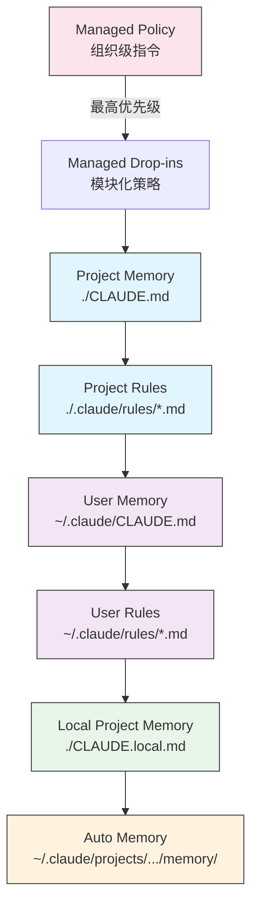

# Claude Code 教程系列：内存系统（Memory）

内存系统使Claude能够在多个会话和对话中保持持久化的上下文。与临时上下文窗口不同，内存文件允许你在团队间共享项目标准、存储个人开发偏好、维护特定目录的规则，并将外部文档导入为版本控制的一部分。

## 核心概念

### 什么是内存系统？

内存系统在Claude Code中提供跨多个会话和对话的持久化上下文。内存文件允许你：

- 在团队间共享项目标准
- 存储个人开发偏好
- 维护目录特定的规则和配置
- 导入外部文档
- 将内存作为项目的一部分进行版本控制

### 内存命令快速参考

| 命令 | 用途 | 使用场景 |
|------|------|----------|
| `/init` | 初始化项目内存 | 开始新项目，首次设置CLAUDE.md |
| `/memory` | 在编辑器中编辑内存文件 | 大量更新、重组、审查内容 |
| `@path/to/file` | 导入外部内容 | 在CLAUDE.md中引用现有文档 |

### 内存层级结构

Claude Code使用多层分级内存系统。内存文件在Claude Code启动时自动加载，更高层级的文件具有优先权：



### 模块化规则系统

使用`.claude/rules/`目录结构创建有组织的、路径特定的规则：

```
your-project/
├── .claude/
│   ├── CLAUDE.md
│   └── rules/
│       ├── code-style.md
│       ├── testing.md
│       ├── security.md
│       └── api/                  # 支持子目录
│           ├── conventions.md
│           └── validation.md
```

使用YAML frontmatter定义适用于特定文件路径的规则：

```markdown
---
paths: src/api/**/*.ts
---

# API开发规则

- 所有API端点必须包含输入验证
- 使用Zod进行架构验证
- 记录所有参数和响应类型
- 为所有操作包含错误处理
```

### 外部内容导入

CLAUDE.md文件支持`@path/to/file`语法来包含外部内容：

```markdown
# 项目文档
见@README.md了解项目概览
见@package.json了解可用的npm命令
见@docs/architecture.md了解系统设计

# 使用绝对路径从主目录导入
@~/.claude/my-project-instructions.md
```

**导入特性：**
- 支持相对路径和绝对路径
- 支持递归导入，最大深度5层
- 首次从外部位置导入时触发批准对话框
- 帮助避免通过引用现有文档来重复内容
- 自动将引用内容包含在Claude的上下文中

### 自动内存

自动内存是一个持久化目录，Claude在处理项目时自动记录学习、模式和见解：

- **位置**：`~/.claude/projects/<project>/memory/`
- **入口点**：`MEMORY.md`是自动内存目录中的主文件
- **主题文件**：用于特定主题的可选附加文件（如`debugging.md`、`api-conventions.md`）
- **加载行为**：`MEMORY.md`的前200行（或前25KB，以先到者为准）在会话开始时加载到上下文中。主题文件按需加载，不在启动时加载

## 实用示例

### 示例1：项目内存结构

**文件：**`./CLAUDE.md`

```markdown
# 项目配置

## 项目概览
- **名称**：电商交易平台
- **技术栈**：Node.js, PostgreSQL, React 18, Docker
- **团队规模**：5名开发者
- **截止日期**：2025年第四季度

## 架构
@docs/architecture.md
@docs/api-standards.md
@docs/database-schema.md

## 开发标准

### 代码风格
- 使用Prettier进行格式化
- 使用ESLint和airbnb配置
- 最大行长度：100字符
- 使用2空格缩进

### 命名约定
- **文件**：kebab-case (user-controller.js)
- **类**：PascalCase (UserService)
- **函数/变量**：camelCase (getUserById)
- **常量**：UPPER_SNAKE_CASE (API_BASE_URL)
- **数据库表**：snake_case (user_accounts)

### Git工作流
- 分支命名：`feature/描述`或`fix/描述`
- 提交消息：遵循conventional commits
- 合并前需要PR
- 所有CI/CD检查必须通过
- 至少需要1个批准
```

### 示例2：路径特定规则

**文件：**`./.claude/rules/api-conventions.md`

```markdown
---
paths: src/api/**/*.ts
---

# API开发规范

所有API端点必须遵循以下规范：

1. **输入验证**：使用Zod架构验证
2. **错误处理**：返回标准错误响应
3. **响应格式**：统一的JSON结构
4. **认证**：JWT token验证
5. **速率限制**：1000请求/小时
```

### 示例3：个人偏好

**文件：**`~/.claude/CLAUDE.md`

```markdown
# 我的开发偏好

## 关于我
- **经验水平**：8年全栈开发经验
- **偏好语言**：TypeScript, Python
- **沟通风格**：直接，附示例
- **学习风格**：带代码的视觉图表

## 代码偏好

### 错误处理
我偏好使用带有try-catch块和有意义错误消息的显式错误处理。
避免通用错误。始终记录错误以便调试。

### 注释
注释用于解释WHY，而不是WHAT。代码应该是自文档化的。
注释应该解释业务逻辑或非显而易见的决策。

### 测试
我偏好TDD（测试驱动开发）。
先写测试，然后实现。
关注行为，而不是实现细节。

### 架构
我偏好模块化、松耦合的设计。
使用依赖注入提高可测试性。
分离关注点（控制器、服务、仓库）。
```

## 最佳实践

### Do's ✅
- **具体详细**：使用清晰、详细的指令，而不是模糊的指导
  - ✅ 好："所有JavaScript文件使用2空格缩进"
  - ❌ 避免："遵循最佳实践"
- **保持有组织**：用清晰的markdown章节和标题构建内存文件结构
- **使用适当的层级**：
  - **Managed policy**：公司范围的政策、安全标准、合规要求
  - **Project memory**：团队标准、架构、编码约定（提交到git）
  - **User memory**：个人偏好、沟通风格、工具选择
  - **Directory memory**：模块特定规则和覆盖
- **利用导入**：使用`@path/to/file`语法引用现有文档
- **记录常用命令**：包含重复使用的命令以节省时间
- **版本控制项目内存**：将项目级CLAUDE.md文件提交到git以造福团队
- **定期审查**：随着项目发展和需求变化定期更新内存

### Don'ts ❌
- 不要存储秘密：永远不要包含API密钥、密码、令牌或凭据
- 不要包含敏感数据：没有PII、私人信息或专有机密
- 不要重复内容：使用导入（`@path`）引用现有文档
- 不要模糊：避免像"遵循最佳实践"或"编写好代码"这样的通用语句
- 不要太长：保持单个内存文件聚焦且少于500行
- 不要过度组织：策略性地使用层级；不要创建过多的子目录覆盖
- 不要忘记更新：过时的内存会导致混乱和过时的实践
- 不要超过嵌套限制：内存导入支持最多5层嵌套

## 相关资源

- [Claude Code内存系统官方文档](https://code.claude.com/docs/en/memory)
- [Claude Code斜杠命令文档](https://code.claude.com/docs/en/interactive-mode)
- [claude-howto教程源码](../claude-howto/02-memory/)

---
这是[Claude Code 教程系列](../claude-howto/)的第二篇文章。下一篇文章将介绍Claude Code的技能系统。