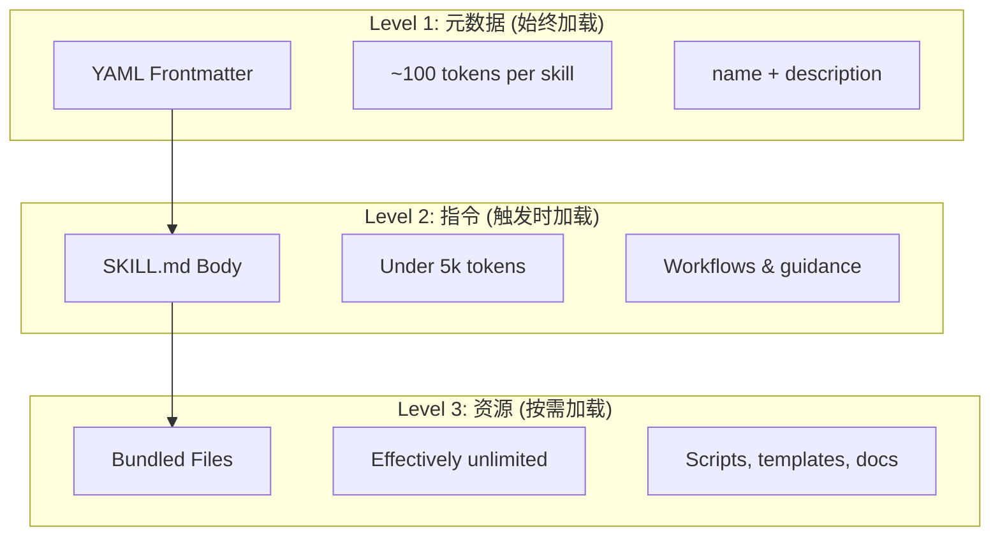

技能系统将领域知识、工作流程、最佳实践打包成可复用的组件，当与任务相关时由claude自动调用。

## 核心概念

### 技能系统

技能系统是模块化能力，将通用AI智能转变为领域专家。与提示词（用于一次性任务的对话级指令）不同，技能按需加载，消除了在多个对话中重复提供相同提示词的需要。

### 关键优势

- **专业化Claude**：为领域特定任务定制能力
- **减少重复**：一次创建，跨对话自动使用
- **组合能力**：组合技能构建复杂工作流
- **扩展工作流**：跨多个项目和团队重用技能
- **保持质量**：将最佳实践直接嵌入工作流

技能遵循[Agent Skills](https://agentskills.io)开放标准，可在多个AI工具中使用。Claude Code通过调用控制、子代理执行和动态上下文注入等功能扩展了该标准。

### 渐进式披露

技能利用**渐进式披露**架构——Claude根据需要分三级加载信息，而不是预先消耗上下文。这实现了高效的上下文管理，同时保持无限的可扩展性。



| 级别                      | 加载时机       | Token成本         | 内容                                            |
| ------------------------- | -------------- | ----------------- | ----------------------------------------------- |
| **Level 1: 元数据** | 始终（启动时） | ~100 tokens/SKILL | YAML frontmatter中的 `name`和 `description` |
| **Level 2: 指令**   | SKILL触发时    | <5k tokens        | SKILL.md正文，包含指令和指导                    |
| **Level 3+: 资源**  | 按需           | 几乎无限          | 通过bash执行的捆绑文件，不加载内容到上下文      |

这意味着你可以安装许多技能而不会产生上下文惩罚——Claude只知道每个技能存在以及何时使用它，直到实际触发为止。

### 技能层级

| 类型             | 位置                                       | 作用域     | 共享          | 最适合     |
| ---------------- | ------------------------------------------ | ---------- | ------------- | ---------- |
| **个人级** | `~/.claude/skills/<skill-name>/SKILL.md` | 个人       | 否            | 个人工作流 |
| **项目级** | `.claude/skills/<skill-name>/SKILL.md`   | 团队       | 是（通过git） | 团队标准   |
| **插件级** | `<plugin>/skills/<skill-name>/SKILL.md`  | 启用的地方 | 取决于        | 与插件捆绑 |

当技能在各层级共享相同名称时，较高优先级的位置胜出：**个人级 > 项目级**。插件技能使用 `plugin-name:skill-name`命名空间，因此它们不会冲突。

## 自定义技能

### 基本目录结构

```
my-skill/
├── SKILL.md           # 主指令（必需）
├── template.md        # Claude填写的模板
├── examples/
│   └── sample.md      # 显示预期格式的示例输出
└── scripts/
    └── validate.sh    # Claude可执行的脚本
```

### SKILL.md格式

```yaml
---
name: your-skill-name
description: 此技能的功能以及何时使用它的简要描述
---

# 你的技能名称

## 指令
为Claude提供清晰、分步的指导。

## 示例
展示使用此技能的具体示例。
```

### Frontmatter

```yaml
---
name: my-skill
description: 此技能的功能以及何时使用它
argument-hint: "[filename] [format]"        # 用于自动完成的预期参数
disable-model-invocation: true              # 仅用户可以调用
user-invocable: false                       # 从/菜单隐藏
allowed-tools: Read, Grep, Glob             # 限制工具访问
model: opus                                 # 要使用的特定模型
effort: high                                # 努力级别覆盖（low, medium, high, max）
context: fork                               # 在隔离子代理中运行
agent: Explore                              # 使用context: fork时的代理类型
shell: bash                                 # 用于命令的Shell：bash（默认）或powershell
hooks:                                      # 技能范围钩子
  PreToolUse:
    - matcher: "Bash"
      hooks:
        - type: command
          command: "./scripts/validate.sh"
paths: "src/api/**/*.ts"               # 限制技能激活时的Glob模式
---
```

| 字段                         | 描述                                                                                   |
| ---------------------------- | -------------------------------------------------------------------------------------- |
| `name`                     | 仅限小写字母、数字和连字符（最多64个字符）。不能包含"anthropic"或"claude"。            |
| `description`              | 技能的功能**以及**何时使用它（最多1024个字符）。自动调用匹配的关键。             |
| `argument-hint`            | 在 `/`自动完成菜单中显示的提示（例如，`"[filename] [format]"`）。                  |
| `disable-model-invocation` | `true` = 只有用户可以通过 `/name`调用。Claude永远不会自动调用。                    |
| `user-invocable`           | `false` = 从 `/`菜单隐藏。只有Claude可以自动调用它。                               |
| `allowed-tools`            | 技能可以在无权限提示的情况下使用的工具的逗号分隔列表。                                 |
| `model`                    | 技能活动时的模型覆盖（例如，`opus`、`sonnet`）。                                   |
| `effort`                   | 技能活动时的努力级别覆盖：`low`、`medium`、`high`或 `max`。                    |
| `context`                  | `fork`以在forked的子代理上下文中运行技能。                                           |
| `agent`                    | `context: fork`时的子代理类型（例如，`Explore`、`Plan`、`general-purpose`）。  |
| `shell`                    | 用于 `!`command``替换和脚本的Shell：`bash`（默认）或 `powershell`。              |
| `hooks`                    | 范围限于此技能生命周期的钩子（与全局钩子相同的格式）。                                 |
| `paths`                    | 限制技能自动激活时间的Glob模式。逗号分隔的字符串或YAML列表。与路径特定规则相同的格式。 |

### SKILL.md内容

#### 参考

可以是约定、模式、风格、领域知识。与你的对话上下文一起内联运行。

```yaml
---
name: api-conventions
description: 此代码库的API设计模式
---

编写API端点时：
- 使用RESTful命名约定
- 返回一致的错误格式
- 包含请求验证
```

#### 任务

特定操作的逐步指令。通常直接使用 `/skill-name`调用。

```yaml
---
name: deploy
description: 将应用程序部署到生产环境
context: fork
disable-model-invocation: true
---

部署应用程序：
1. 运行测试套件
2. 构建应用程序
3. 推送到部署目标
```

### 参数传递

| 变量                       | 描述                                      |
| -------------------------- | ----------------------------------------- |
| `$ARGUMENTS`             | 调用技能时传递的所有参数                  |
| `$ARGUMENTS[N]`或 `$N` | 按索引访问特定参数（从0开始）             |
| `${CLAUDE_SESSION_ID}`   | 当前会话ID                                |
| `${CLAUDE_SKILL_DIR}`    | 包含技能的SKILL.md文件的目录              |
| ``!`command` ``            | 动态上下文注入 — 运行shell命令并内联输出 |

**示例：**

```yaml
---
name: fix-issue
description: 修复GitHub问题
---

遵循我们的编码标准修复GitHub问题$ARGUMENTS。
1. 阅读问题描述
2. 实施修复
3. 编写测试
4. 创建提交
```

运行 `/fix-issue 123`将 `$ARGUMENTS`替换为 `123`。

### 注入动态上下文

`!`command``语法在将技能内容发送给Claude之前运行shell命令：

```yaml
---
name: pr-summary
description: 总结Pull Request中的更改
context: fork
agent: Explore
---

## Pull Request上下文
- PR diff：!`gh pr diff`
- PR评论：!`gh pr view --comments`
- 更改的文件：!`gh pr diff --name-only`

## 你的任务
总结这个Pull Request...
```

命令立即执行；Claude只看到最终输出。默认情况下，命令在 `bash`中运行。在frontmatter中设置 `shell: powershell`以改用PowerShell。

## 实用示例

### 代码审查

**目录结构：**

```
~/.claude/skills/code-review/
├── SKILL.md
├── templates/
│   ├── review-checklist.md
│   └── finding-template.md
└── scripts/
    ├── analyze-metrics.py
    └── compare-complexity.py
```

**文件：**`~/.claude/skills/code-review/SKILL.md`

```yaml
---
name: code-review-specialist
description: 全面代码审查，包括安全性、性能和质量分析。当用户要求审查代码、分析代码质量、评估PR或提及代码审查、安全分析或性能优化时使用。
---

# 代码审查技能

本技能提供全面的代码审查能力，重点关注：

1. **安全分析**
   - 认证/授权问题
   - 数据暴露风险
   - 注入漏洞
   - 加密弱点

2. **性能审查**
   - 算法效率（Big O分析）
   - 内存优化
   - 数据库查询优化
   - 缓存机会

3. **代码质量**
   - SOLID原则
   - 设计模式
   - 命名约定
   - 测试覆盖率

4. **可维护性**
   - 代码可读性
   - 函数大小（应<50行）
   - 圈复杂度
   - 类型安全

## 审查模板

对于每段审查的代码，提供：

### 摘要
- 整体质量评估（1-5）
- 关键发现计数
- 推荐优先级领域

### 关键问题（如果有）
- **问题**：清晰描述
- **位置**：文件和行号
- **影响**：为什么重要
- **严重性**：Critical/High/Medium
- **修复**：代码示例

有关详细检查清单，请参阅[templates/review-checklist.md](templates/review-checklist.md)。
```

### 代码库可视化

生成交互式HTML可视化的技能：

**目录结构：**

```
~/.claude/skills/codebase-visualizer/
├── SKILL.md
└── scripts/
    └── visualize.py
```

**文件：**`~/.claude/skills/codebase-visualizer/SKILL.md`

````yaml
---
name: codebase-visualizer
description: 生成你的代码库的交互式可折叠树可视化。探索新存储库、理解项目结构或识别大文件时使用。
allowed-tools: Bash(python *)
---

# 代码库可视化器

生成显示项目文件结构的交互式HTML树视图。

## 使用

从项目根目录运行可视化脚本：

```bash
python ~/.claude/skills/codebase-visualizer/scripts/visualize.py .
```

这将创建`codebase-map.html`并在默认浏览器中打开。

## 可视化显示的内容

- **可折叠目录**：点击文件夹以展开/折叠
- **文件大小**：每个文件旁边显示
- **颜色**：不同文件类型的不同颜色
- **目录总计**：显示每个文件夹的聚合大小
````

捆绑的Python脚本处理繁重的工作，而Claude处理编排。

### 代码重构

**目录结构：**

```
refactor/
├── SKILL.md
├── references/
│   ├── code-smells.md
│   └── refactoring-catalog.md
├── templates/
│   └── refactoring-plan.md
└── scripts/
    ├── analyze-complexity.py
    └── detect-smells.py
```

**文件：**`refactor/SKILL.md`

```yaml
---
name: code-refactor
description: 基于Martin Fowler方法论的系统性代码重构。当用户要求重构代码、改进代码结构、减少技术债务或消除代码气味时使用。
---

# 代码重构技能

强调安全、增量更改和测试支持的分阶段方法。

## 工作流

阶段1：研究与分析 → 阶段2：测试覆盖率评估 →
阶段3：代码气味识别 → 阶段4：重构计划创建 →
阶段5：增量实施 → 阶段6：审查和迭代

## 核心原则

1. **行为保留**：外部行为必须保持不变
2. **小步骤**：进行微小的、可测试的更改
3. **测试驱动**：测试是安全网
4. **持续**：重构是持续的，而不是一次性事件

有关代码气味目录，请参阅[references/code-smells.md](references/code-smells.md)。
有关重构技术，请参阅[references/refactoring-catalog.md](references/refactoring-catalog.md)。
```

## 最佳实践

### Do's

- 使用清晰、描述性的名称
- 包含全面的指令
- 添加具体示例
- 打包相关的脚本和模板
- 使用真实场景测试
- 记录依赖项

### Don'ts

- 不要为一次性任务创建技能
- 不要重复现有功能
- 不要让技能太宽泛
- 不要跳过description字段
- 不要从不受信任的来源安装技能而不进行审计

## 相关资源

- [Claude Code技能系统官方文档](https://code.claude.com/docs/en/skills)
- [Agent Skills架构博客](https://claude.com/blog/equipping-agents-for-the-real-world-with-agent-skills)
- [技能存储库](https://github.com/luongnv89/skills) - 现成可用技能集合
- [斜杠命令指南](../01-slash-commands/) - 用户发起的快捷方式
- [子代理指南](../04-subagents/) - 委托的AI代理
- [内存指南](../02-memory/) - 持久化上下文
- [MCP (Model Context Protocol)](../05-mcp/) - 实时外部数据
- [钩子指南](../06-hooks/) - 事件驱动的自动化

---

这是[Claude Code 教程系列](../claude-howto/)的第三篇文章。下一篇文章将介绍Claude Code的子代理系统。
