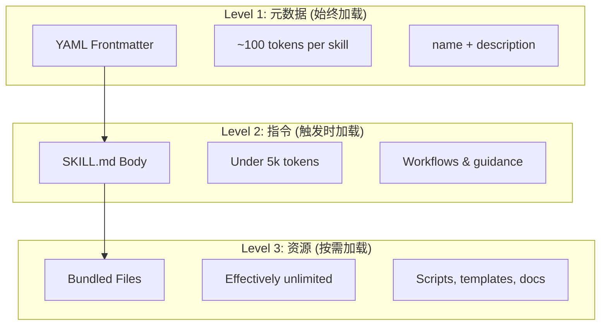
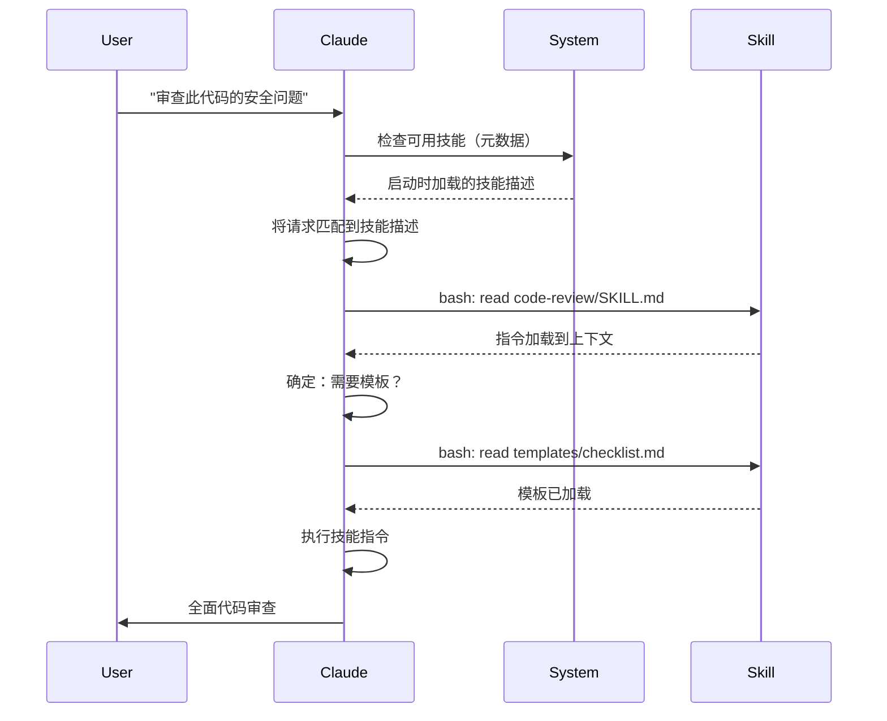

代理技能（Agent Skills）是可复用的、基于文件系统的功能，扩展了Claude的能力。它们将领域专业知识、工作流程和最佳实践打包成可发现的组件，当相关时Claude会自动使用这些组件。

## 核心概念

### 什么是技能系统？

代理技能是模块化能力，将通用代理转变为专家。与提示词（用于一次性任务的对话级指令）不同，技能按需加载，消除了在多个对话中重复提供相同指导的需要。

### 关键优势

- **专业化Claude**：为领域特定任务定制能力
- **减少重复**：一次创建，跨对话自动使用
- **组合能力**：组合技能构建复杂工作流
- **扩展工作流**：跨多个项目和团队重用技能
- **保持质量**：将最佳实践直接嵌入工作流

技能遵循[Agent Skills](https://agentskills.io)开放标准，可在多个AI工具中使用。Claude Code通过调用控制、子代理执行和动态上下文注入等功能扩展了该标准。

> **注意**：自定义斜杠命令已合并到技能中。`.claude/commands/`文件仍然工作并支持相同的frontmatter字段。建议新开发使用技能。当同一路径同时存在两者时（如`.claude/commands/review.md`和`.claude/skills/review/SKILL.md`），技能优先。

### 技能的工作原理：渐进式披露

技能利用**渐进式披露**架构——Claude根据需要分阶段加载信息，而不是预先消耗上下文。这实现了高效的上下文管理，同时保持无限的可扩展性。

### 三级加载



| 级别 | 加载时机 | Token成本 | 内容 |
|------|----------|------------|------|
| **Level 1: 元数据** | 始终（启动时） | ~100 tokens/SKILL | YAML frontmatter中的`name`和`description` |
| **Level 2: 指令** | SKILL触发时 | <5k tokens | SKILL.md正文，包含指令和指导 |
| **Level 3+: 资源** | 按需 | 几乎无限 | 通过bash执行的捆绑文件，不加载内容到上下文 |

这意味着你可以安装许多技能而不会产生上下文惩罚——Claude只知道每个技能存在以及何时使用它，直到实际触发为止。

### 技能加载过程



### 技能类型与位置

| 类型 | 位置 | 作用域 | 共享 | 最适合 |
|------|------|--------|------|--------|
| **企业级** | Managed settings | 所有组织用户 | 是 | 组织范围的标准 |
| **个人级** | `~/.claude/skills/<skill-name>/SKILL.md` | 个人 | 否 | 个人工作流 |
| **项目级** | `.claude/skills/<skill-name>/SKILL.md` | 团队 | 是（通过git） | 团队标准 |
| **插件级** | `<plugin>/skills/<skill-name>/SKILL.md` | 启用的地方 | 取决于 | 与插件捆绑 |

当技能在各层级共享相同名称时，较高优先级的位置胜出：**企业级 > 个人级 > 项目级**。插件技能使用`plugin-name:skill-name`命名空间，因此它们不会冲突。

### 自动发现

**嵌套目录**：当你在子目录中处理文件时，Claude Code会自动发现来自嵌套`.claude/skills/`目录的技能。例如，如果你在`packages/frontend/`中编辑文件，Claude Code也会在`packages/frontend/.claude/skills/`中查找技能。这支持包具有自己技能的monorepo设置。

**`--add-dir`目录**：通过`--add-dir`添加的目录中的技能自动加载并具有实时更改检测。对该目录中技能文件的任何编辑立即生效，无需重启Claude Code。

**描述预算**：技能描述（Level 1元数据）上限为**上下文窗口的1%**（回退：**8,000个字符**）。如果你安装了许多技能，描述可能会被缩短。所有技能名称始终包含在内，但描述被修剪以适应。在描述中前置主要用例。使用`SLASH_COMMAND_TOOL_CHAR_BUDGET`环境变量覆盖预算。

## 创建自定义技能

### 基本目录结构

```
my-skill/
├── SKILL.md           # 主指令（必需）
├── template.md        # Claude填写的模板
├── examples/
│   └── sample.md      # 显示预期格式的示例输出
└── scripts/
    └── validate.sh    # Claude可执行的脚本
```

### SKILL.md格式

```yaml
---
name: your-skill-name
description: 此技能的功能以及何时使用它的简要描述
---

# 你的技能名称

## 指令
为Claude提供清晰、分步的指导。

## 示例
展示使用此技能的具体示例。
```

### 必需字段

- **name**：仅限小写字母、数字和连字符（最多64个字符）。不能包含"anthropic"或"claude"。
- **description**：技能的功能**以及**何时使用它（最多1024个字符）。这是Claude知道何时激活技能的关键。

### 可选Frontmatter字段

```yaml
---
name: my-skill
description: 此技能的功能以及何时使用它
argument-hint: "[filename] [format]"        # 用于自动完成的预期参数
disable-model-invocation: true              # 仅用户可以调用
user-invocable: false                       # 从/菜单隐藏
allowed-tools: Read, Grep, Glob             # 限制工具访问
model: opus                                 # 要使用的特定模型
effort: high                                # 努力级别覆盖（low, medium, high, max）
context: fork                               # 在隔离子代理中运行
agent: Explore                              # 使用context: fork时的代理类型
shell: bash                                 # 用于命令的Shell：bash（默认）或powershell
hooks:                                      # 技能范围钩子
  PreToolUse:
    - matcher: "Bash"
      hooks:
        - type: command
          command: "./scripts/validate.sh"
paths: "src/api/**/*.ts"               # 限制技能激活时的Glob模式
---
```

| 字段 | 描述 |
|-------|-------------|
| `name` | 仅限小写字母、数字和连字符（最多64个字符）。不能包含"anthropic"或"claude"。 |
| `description` | 技能的功能**以及**何时使用它（最多1024个字符）。自动调用匹配的关键。 |
| `argument-hint` | 在`/`自动完成菜单中显示的提示（例如，`"[filename] [format]"`）。 |
| `disable-model-invocation` | `true` = 只有用户可以通过`/name`调用。Claude永远不会自动调用。 |
| `user-invocable` | `false` = 从`/`菜单隐藏。只有Claude可以自动调用它。 |
| `allowed-tools` | 技能可以在无权限提示的情况下使用的工具的逗号分隔列表。 |
| `model` | 技能活动时的模型覆盖（例如，`opus`、`sonnet`）。 |
| `effort` | 技能活动时的努力级别覆盖：`low`、`medium`、`high`或`max`。 |
| `context` | `fork`以在forked的子代理上下文中运行技能。 |
| `agent` | `context: fork`时的子代理类型（例如，`Explore`、`Plan`、`general-purpose`）。 |
| `shell` | 用于`!`command``替换和脚本的Shell：`bash`（默认）或`powershell`。 |
| `hooks` | 范围限于此技能生命周期的钩子（与全局钩子相同的格式）。 |
| `paths` | 限制技能自动激活时间的Glob模式。逗号分隔的字符串或YAML列表。与路径特定规则相同的格式。 |

### 技能内容类型

技能可以包含两种类型的内容，每种都适合不同的用途：

#### 引用内容

添加Claude应用于你当前工作的知识——约定、模式、风格指南、领域知识。与你的对话上下文一起内联运行。

```yaml
---
name: api-conventions
description: 此代码库的API设计模式
---

编写API端点时：
- 使用RESTful命名约定
- 返回一致的错误格式
- 包含请求验证
```

#### 任务内容

特定操作的逐步指令。通常直接使用`/skill-name`调用。

```yaml
---
name: deploy
description: 将应用程序部署到生产环境
context: fork
disable-model-invocation: true
---

部署应用程序：
1. 运行测试套件
2. 构建应用程序
3. 推送到部署目标
```

### 控制技能调用

默认情况下，你和Claude都可以调用任何技能。两个frontmatter字段控制三种调用模式：

| Frontmatter | 你可以调用 | Claude可以调用 |
|---|---|---|
| (默认) | 是 | 是 |
| `disable-model-invocation: true` | 是 | 否 |
| `user-invocable: false` | 否 | 是 |

**使用`disable-model-invocation: true`**用于有副作用的流程：`/commit`、`/deploy`、`/send-slack-message`。你不希望Claude因为代码看起来准备好了就决定部署。

**使用`user-invocable: false`**用于不是命令的有用后台知识。`legacy-system-context`技能解释旧系统如何工作——对Claude有用，但对用户不是有意义的操作。

### 字符串替换

技能支持在技能内容到达Claude之前解析的动态值：

| 变量 | 描述 |
|----------|-------------|
| `$ARGUMENTS` | 调用技能时传递的所有参数 |
| `$ARGUMENTS[N]`或`$N` | 按索引访问特定参数（从0开始） |
| `${CLAUDE_SESSION_ID}` | 当前会话ID |
| `${CLAUDE_SKILL_DIR}` | 包含技能的SKILL.md文件的目录 |
| `` !`command` `` | 动态上下文注入 — 运行shell命令并内联输出 |

**示例：**

```yaml
---
name: fix-issue
description: 修复GitHub问题
---

遵循我们的编码标准修复GitHub问题$ARGUMENTS。
1. 阅读问题描述
2. 实施修复
3. 编写测试
4. 创建提交
```

运行`/fix-issue 123`将`$ARGUMENTS`替换为`123`。

### 注入动态上下文

`!`command``语法在将技能内容发送给Claude之前运行shell命令：

```yaml
---
name: pr-summary
description: 总结Pull Request中的更改
context: fork
agent: Explore
---

## Pull Request上下文
- PR diff：!`gh pr diff`
- PR评论：!`gh pr view --comments`
- 更改的文件：!`gh pr diff --name-only`

## 你的任务
总结这个Pull Request...
```

命令立即执行；Claude只看到最终输出。默认情况下，命令在`bash`中运行。在frontmatter中设置`shell: powershell`以改用PowerShell。

### 在子代理中运行技能

添加`context: fork`以在隔离子代理上下文中运行技能。技能内容成为具有自己上下文窗口的专用子代理的任务，保持主对话整洁。

`agent`字段指定要使用的代理类型：

| 代理类型 | 最适合 |
|---|---|
| `Explore` | 只读研究、代码库分析 |
| `Plan` | 创建实施计划 |
| `general-purpose` | 需要所有工具的广泛任务 |
| 自定义代理 | 配置中定义的专用代理 |

**示例frontmatter：**

```yaml
---
context: fork
agent: Explore
---
```

**完整技能示例：**

```yaml
---
name: deep-research
description: 深入研究主题
context: fork
agent: Explore
---

彻底研究$ARGUMENTS：
1. 使用Glob和Grep查找相关文件
2. 阅读和分析代码
3. 用特定文件引用总结发现
```

## 实用示例

### 示例1：代码审查技能

**目录结构：**

```
~/.claude/skills/code-review/
├── SKILL.md
├── templates/
│   ├── review-checklist.md
│   └── finding-template.md
└── scripts/
    ├── analyze-metrics.py
    └── compare-complexity.py
```

**文件：**`~/.claude/skills/code-review/SKILL.md`

```yaml
---
name: code-review-specialist
description: 全面代码审查，包括安全性、性能和质量分析。当用户要求审查代码、分析代码质量、评估PR或提及代码审查、安全分析或性能优化时使用。
---

# 代码审查技能

本技能提供全面的代码审查能力，重点关注：

1. **安全分析**
   - 认证/授权问题
   - 数据暴露风险
   - 注入漏洞
   - 加密弱点

2. **性能审查**
   - 算法效率（Big O分析）
   - 内存优化
   - 数据库查询优化
   - 缓存机会

3. **代码质量**
   - SOLID原则
   - 设计模式
   - 命名约定
   - 测试覆盖率

4. **可维护性**
   - 代码可读性
   - 函数大小（应<50行）
   - 圈复杂度
   - 类型安全

## 审查模板

对于每段审查的代码，提供：

### 摘要
- 整体质量评估（1-5）
- 关键发现计数
- 推荐优先级领域

### 关键问题（如果有）
- **问题**：清晰描述
- **位置**：文件和行号
- **影响**：为什么重要
- **严重性**：Critical/High/Medium
- **修复**：代码示例

有关详细检查清单，请参阅[templates/review-checklist.md](templates/review-checklist.md)。
```

### 示例2：代码库可视化器技能

生成交互式HTML可视化的技能：

**目录结构：**

```
~/.claude/skills/codebase-visualizer/
├── SKILL.md
└── scripts/
    └── visualize.py
```

**文件：**`~/.claude/skills/codebase-visualizer/SKILL.md`

````yaml
---
name: codebase-visualizer
description: 生成你的代码库的交互式可折叠树可视化。探索新存储库、理解项目结构或识别大文件时使用。
allowed-tools: Bash(python *)
---

# 代码库可视化器

生成显示项目文件结构的交互式HTML树视图。

## 使用

从项目根目录运行可视化脚本：

```bash
python ~/.claude/skills/codebase-visualizer/scripts/visualize.py .
```

这将创建`codebase-map.html`并在默认浏览器中打开。

## 可视化显示的内容

- **可折叠目录**：点击文件夹以展开/折叠
- **文件大小**：每个文件旁边显示
- **颜色**：不同文件类型的不同颜色
- **目录总计**：显示每个文件夹的聚合大小
````

捆绑的Python脚本处理繁重的工作，而Claude处理编排。

### 示例3：部署技能（仅用户调用）

```yaml
---
name: deploy
description: 将应用程序部署到生产环境
disable-model-invocation: true
allowed-tools: Bash(npm *), Bash(git *)
---

将$ARGUMENTS部署到生产环境：

1. 运行测试套件：`npm test`
2. 构建应用程序：`npm run build`
3. 推送到部署目标
4. 验证部署成功
5. 报告部署状态
```

### 示例4：品牌声音技能（后台知识）

```yaml
---
name: brand-voice
description: 确保所有沟通都符合品牌声音和语调指南。创建营销文案、客户沟通或面向公众的内容时使用。
user-invocable: false
---

## 语调
- **友好但专业** - 亲切但不随意
- **清晰简洁** - 避免术语
- **自信** - 我们知道自己在做什么
- **共情** - 理解用户需求

## 写作指南
- 称呼读者时使用"你"
- 使用主动语态
- 句子保持20词以内
- 以价值主张开头

有关模板，请参阅[templates/](templates/)。
```

### 示例5：CLAUDE.md生成器技能

```yaml
---
name: claude-md
description: 创建或更新CLAUDE.md文件，遵循AI代理入职的最佳实践。当用户提及CLAUDE.md、项目文档或AI入职时使用。
---

## 核心原则

**LLMs是无状态的**：CLAUDE.md是自动包含在每个对话中的唯一文件。

### 黄金法则

1. **少即是多**：保持在300行以下（最好在100行以下）
2. **普遍适用性**：仅包含与每个会话相关的信息
3. **不要将Claude用作Linter**：改用确定性工具
4. **永不自动生成**：通过仔细考虑手动创建

## 基本章节

- **项目名称**：简短的一行描述
- **技术栈**：主要语言、框架、数据库
- **开发命令**：安装、测试、构建命令
- **关键约定**：仅非显而易见、高影响的约定
- **已知问题/Gotchas**：困扰开发者的内容
```

### 示例6：带脚本的重构技能

**目录结构：**

```
refactor/
├── SKILL.md
├── references/
│   ├── code-smells.md
│   └── refactoring-catalog.md
├── templates/
│   └── refactoring-plan.md
└── scripts/
    ├── analyze-complexity.py
    └── detect-smells.py
```

**文件：**`refactor/SKILL.md`

```yaml
---
name: code-refactor
description: 基于Martin Fowler方法论的系统性代码重构。当用户要求重构代码、改进代码结构、减少技术债务或消除代码气味时使用。
---

# 代码重构技能

强调安全、增量更改和测试支持的分阶段方法。

## 工作流

阶段1：研究与分析 → 阶段2：测试覆盖率评估 →
阶段3：代码气味识别 → 阶段4：重构计划创建 →
阶段5：增量实施 → 阶段6：审查和迭代

## 核心原则

1. **行为保留**：外部行为必须保持不变
2. **小步骤**：进行微小的、可测试的更改
3. **测试驱动**：测试是安全网
4. **持续**：重构是持续的，而不是一次性事件

有关代码气味目录，请参阅[references/code-smells.md](references/code-smells.md)。
有关重构技术，请参阅[references/refactoring-catalog.md](references/refactoring-catalog.md)。
```

## 支持文件

技能可以在`SKILL.md`之外的目录中包含多个文件。这些支持文件（模板、示例、脚本、参考文档）让你保持主技能文件聚焦，同时为Claude提供根据需要加载的附加资源。

```
my-skill/
├── SKILL.md              # 主指令（必需，保持在500行以下）
├── templates/            # Claude填写的模板
│   └── output-format.md
├── examples/             # 显示预期格式的示例输出
│   └── sample-output.md
├── references/           # 领域知识和规范
│   └── api-spec.md
└── scripts/              # Claude可执行的脚本
    └── validate.sh
```

支持文件指南：

- 保持`SKILL.md`在**500行以下**。将详细的参考材料、大型示例和规范移动到单独的文件。
- 使用**相对路径**从`SKILL.md`引用附加文件（例如，`[API参考](references/api-spec.md)`）。
- 支持文件在Level 3（按需）加载，因此在Claude实际读取它们之前不消耗上下文。

## 管理技能

### 查看可用技能

直接询问Claude：
```
有哪些可用的技能？
```

或检查文件系统：
```bash
# 列出个人技能
ls ~/.claude/skills/

# 列出项目技能
ls .claude/skills/
```

### 测试技能

两种测试方式：

**让Claude自动调用**，通过询问与描述匹配的内容：
```
你能帮我审查这段代码的安全问题吗？
```

**或直接调用**使用技能名称：
```
/code-review src/auth/login.ts
```

### 更新技能

直接编辑`SKILL.md`。更改在下次Claude Code启动时生效。

```bash
# 个人技能
code ~/.claude/skills/my-skill/SKILL.md

# 项目技能
code .claude/skills/my-skill/SKILL.md
```

### 限制Claude的技能访问

三种控制Claude可以调用哪些技能的方法：

**在`/permissions`中禁用所有技能**：
```
# 添加到拒绝规则：
Skill
```

**允许或拒绝特定技能**：
```
# 仅允许特定技能
Skill(commit)
Skill(review-pr *)

# 拒绝特定技能
Skill(deploy *)
```

**通过在它们的frontmatter中添加`disable-model-invocation: true`来隐藏单个技能。**

## 最佳实践

### 1. 使描述具体

- **差（模糊）**："帮助处理文档"
- **好（具体）**："从PDF文件中提取文本和表格，填写表单，合并文档。处理PDF文件或用户提及PDF、表单或文档提取时使用。"

### 2. 保持技能聚焦

- 一个技能 = 一种能力
- ✅ "PDF表单填写"
- ❌ "文档处理"（太宽泛）

### 3. 包含触发术语

在描述中添加与用户请求匹配的关键词：
```yaml
description: 分析Excel电子表格、生成数据透视表、创建图表。处理Excel文件、电子表格或.xlsx文件时使用。
```

### 4. 将SKILL.md保持在500行以下

将详细的参考材料移动到Claude按需加载的单独文件。

### 5. 引用支持文件

```markdown
## 附加资源

- 有关完整的API详细信息，请参阅reference.md
- 有关使用示例，请参阅examples.md
```

### Do's

- 使用清晰、描述性的名称
- 包含全面的指令
- 添加具体示例
- 打包相关的脚本和模板
- 使用真实场景测试
- 记录依赖项

### Don'ts

- 不要为一次性任务创建技能
- 不要重复现有功能
- 不要让技能太宽泛
- 不要跳过description字段
- 不要从不受信任的来源安装技能而不进行审计

## 故障排除

### 快速参考

| 问题 | 解决方案 |
|-------|----------|
| Claude不使用技能 | 使描述更具体并包含触发术语 |
| 找不到技能文件 | 验证路径：`~/.claude/skills/name/SKILL.md` |
| YAML错误 | 检查`---`标记、缩进、无制表符 |
| 技能冲突 | 在描述中使用不同的触发术语 |
| 脚本不运行 | 检查权限：`chmod +x scripts/*.py` |
| Claude看不到所有技能 | 技能太多；检查`/context`以获取警告 |

### 技能未触发

如果Claude在你预期时未使用你的技能：

1. 检查描述包含用户自然会说的关键词
2. 验证当你询问"有哪些可用的技能？"时技能出现
3. 尝试重新表述你的请求以匹配描述
4. 用`/skill-name`直接调用以测试

### 技能过于频繁触发

如果Claude在你不想使用时使用你的技能：

1. 使描述更具体
2. 为仅手动调用添加`disable-model-invocation: true`

### Claude看不到所有技能

技能描述在**上下文窗口的1%**处加载（回退：**8,000个字符**）。每个条目无论预算如何都限制为250个字符。运行`/context`检查关于排除技能的警告。使用`SLASH_COMMAND_TOOL_CHAR_BUDGET`环境变量覆盖预算。

## 安全考虑

**仅使用来自受信任来源的技能。**技能通过指令和代码为Claude提供能力——恶意技能可以通过有害方式指导Claude调用工具或执行代码。

**关键安全考虑：**

- **彻底审计**：审查技能目录中的所有文件
- **外部来源有风险**：从外部URL获取的技能可能会被破坏
- **工具误用**：恶意技能可能以有害方式调用工具
- **像安装软件一样处理**：仅使用来自受信任来源的技能

## 技能与其他功能

| 功能 | 调用 | 最适合 |
|---------|------------|----------|
| **技能** | 自动或`/name` | 可复用的专业知识、工作流 |
| **斜杠命令** | 用户发起的`/name` | 快速快捷方式（已合并到技能中） |
| **子代理** | 自动委托 | 隔离的任务执行 |
| **内存（CLAUDE.md）** | 始终加载 | 持久的项目上下文 |
| **MCP** | 实时 | 外部数据/服务访问 |
| **钩子** | 事件驱动 | 自动化副作用 |

## 捆绑技能

Claude Code附带几个内置技能，始终可用，无需安装：

| 技能 | 描述 |
|-------|-------------|
| `/simplify` | 审查更改文件的可重用性、质量和效率；生成3个并行审查代理 |
| `/batch <instruction>` | 使用git worktree在代码库中编排大规模并行更改 |
| `/debug [description]` | 通过读取调试日志来排查当前会话问题 |
| `/loop [interval] <prompt>` | 在间隔上重复运行提示（例如，`/loop 5m check the deploy`） |
| `/claude-api` | 加载Claude API/SDK参考；在`anthropic`/`@anthropic-ai/sdk`导入时自动激活 |

这些技能开箱即用，无需安装或配置。它们遵循与自定义技能相同的SKILL.md格式。

## 共享技能

### 项目技能（团队共享）

1. 在`.claude/skills/`中创建技能
2. 提交到git
3. 团队成员拉取更改 — 技能立即可用

### 个人技能

```bash
# 复制到个人目录
cp -r my-skill ~/.claude/skills/

# 使脚本可执行
chmod +x ~/.claude/skills/my-skill/scripts/*.py
```

### 插件分发

将技能打包在插件的`skills/`目录中，以便进行更广泛的分发。

## 进一步：技能集合和技能管理器

一旦开始认真构建技能，两件事变得必不可少：一套经过验证的技能和一个管理它们的工具。

**[luongnv89/skills](https://github.com/luongnv89/skills)** — 我在几乎所有项目中日常使用的技能集合。亮点包括`logo-designer`（即时生成项目徽标）和`ollama-optimizer`（针对你的硬件调整本地LLM性能）。如果你想要现成的技能，这是一个很好的起点。

**[luongnv89/asm](https://github.com/luongnv89/asm)** — Agent Skill Manager。处理技能开发、重复检测和测试。`asm link`命令让你可以在任何项目中测试技能而无需复制文件 —— 一旦你有超过少数几个技能，这至关重要。

## 相关资源

- [Claude Code技能系统官方文档](https://code.claude.com/docs/en/skills)
- [Agent Skills架构博客](https://claude.com/blog/equipping-agents-for-the-real-world-with-agent-skills)
- [技能存储库](https://github.com/luongnv89/skills) - 现成可用技能集合
- [斜杠命令指南](../01-slash-commands/) - 用户发起的快捷方式
- [子代理指南](../04-subagents/) - 委托的AI代理
- [内存指南](../02-memory/) - 持久化上下文
- [MCP (Model Context Protocol)](../05-mcp/) - 实时外部数据
- [钩子指南](../06-hooks/) - 事件驱动的自动化

---
这是[Claude Code 教程系列](../claude-howto/)的第三篇文章。下一篇文章将介绍Claude Code的子代理系统。