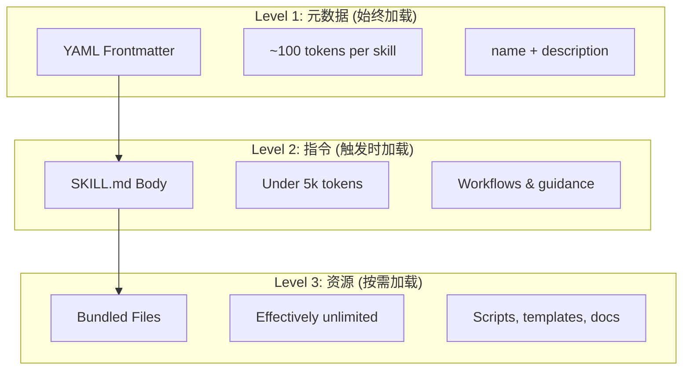

# Claude Code 教程系列：技能（Skills）

代理技能（Agent Skills）是可复用的、基于文件系统的功能，扩展了Claude的能力。它们将领域专业知识、工作流程和最佳实践打包成可发现的组件，当相关时Claude会自动使用这些组件。

## 核心概念

### 什么是技能系统？

代理技能是模块化能力，将通用代理转变为专家。与提示词（用于一次性任务的对话级指令）不同，技能按需加载，消除了在多个对话中重复提供相同指导的需要。

### 关键优势

- **专业化Claude**：为领域特定任务定制能力
- **减少重复**：一次创建，跨对话自动使用
- **组合能力**：组合技能构建复杂工作流
- **扩展工作流**：跨多个项目和团队重用技能
- **保持质量**：将最佳实践直接嵌入工作流

技能遵循[Agent Skills](https://agentskills.io)开放标准，可在多个AI工具中使用。Claude Code通过调用控制、子代理执行和动态上下文注入等功能扩展了该标准。

> **注意**：自定义斜杠命令已合并到技能中。`.claude/commands/`文件仍然工作并支持相同的frontmatter字段。建议新开发使用技能。当同一路径同时存在两者时（如`.claude/commands/review.md`和`.claude/skills/review/SKILL.md`），技能优先。

### 渐进式加载：三级加载架构

技能利用**渐进式披露**架构——Claude根据需要分阶段加载信息，而不是预先消耗上下文。这实现了高效的上下文管理，同时保持无限的可扩展性。



| 级别 | 加载时机 | Token成本 | 内容 |
|------|----------|------------|------|
| **Level 1: 元数据** | 始终（启动时） | ~100 tokens/SKILL | YAML frontmatter中的`name`和`description` |
| **Level 2: 指令** | SKILL触发时 | <5k tokens | SKILL.md正文，包含指令和指导 |
| **Level 3+: 资源** | 按需 | 几乎无限 | 通过bash执行的捆绑文件，不加载内容到上下文 |

这意味着你可以安装许多技能而不会产生上下文惩罚——Claude只知道每个技能存在以及何时使用它，直到实际触发为止。

### 技能类型与位置

| 类型 | 位置 | 作用域 | 共享 | 最适合 |
|------|------|--------|------|--------|
| **企业级** | Managed settings | 所有组织用户 | 是 | 组织范围的标准 |
| **个人级** | `~/.claude/skills/<skill-name>/SKILL.md` | 个人 | 否 | 个人工作流 |
| **项目级** | `.claude/skills/<skill-name>/SKILL.md` | 团队 | 是（通过git） | 团队标准 |
| **插件级** | `<plugin>/skills/<skill-name>/SKILL.md` | 启用的地方 | 取决于 | 与插件捆绑 |

### 调用控制

默认情况下，你和Claude都可以调用任何技能。两个frontmatter字段控制三种调用模式：

| Frontmatter | 你可以调用 | Claude可以调用 |
|---|---|---|
| (默认) | 是 | 是 |
| `disable-model-invocation: true` | 是 | 否 |
| `user-invocable: false` | 否 | 是 |

**使用`disable-model-invocation: true`**用于有副作用的流程：`/commit`、`/deploy`、`/send-slack-message`。你不希望Claude因为代码看起来准备好了就决定部署。

**使用`user-invocable: false`**用于不是命令的有用后台知识。`legacy-system-context`技能解释旧系统如何工作——对Claude有用，但对用户不是有意义的操作。

## 实用示例

### 示例1：代码审查技能

**目录结构：**

```
~/.claude/skills/code-review/
├── SKILL.md
├── templates/
│   ├── review-checklist.md
│   └── finding-template.md
└── scripts/
    ├── analyze-metrics.py
    └── compare-complexity.py
```

**文件：**`~/.claude/skills/code-review/SKILL.md`

```yaml
---
name: code-review-specialist
description: 全面代码审查，包括安全性、性能和质量分析。当用户要求审查代码、分析代码质量、评估PR或提及代码审查、安全分析或性能优化时使用。
---

# 代码审查技能

本技能提供全面的代码审查能力，重点关注：

1. **安全分析**
   - 认证/授权问题
   - 数据暴露风险
   - 注入漏洞
   - 加密弱点

2. **性能审查**
   - 算法效率（Big O分析）
   - 内存优化
   - 数据库查询优化
   - 缓存机会

3. **代码质量**
   - SOLID原则
   - 设计模式
   - 命名约定
   - 测试覆盖率

4. **可维护性**
   - 代码可读性
   - 函数大小（应<50行）
   - 圈复杂度
   - 类型安全
```

### 示例2：部署技能（仅用户调用）

```yaml
---
name: deploy
description: 将应用程序部署到生产环境
disable-model-invocation: true
allowed-tools: Bash(npm *), Bash(git *)
---

将 $ARGUMENTS 部署到生产环境：

1. 运行测试套件：`npm test`
2. 构建应用程序：`npm run build`
3. 推送到部署目标
4. 验证部署成功
5. 报告部署状态
```

### 示例3：品牌声音技能（后台知识）

```yaml
---
name: brand-voice
description: 确保所有沟通都符合品牌声音和语调指南。创建营销文案、客户沟通或面向公众的内容时使用。
user-invocable: false
---

## 语调
- **友好但专业** - 亲切但不随意
- **清晰简洁** - 避免术语
- **自信** - 我们知道自己在做什么
- **共情** - 理解用户需求

## 写作指南
- 称呼读者时使用"你"
- 使用主动语态
- 句子保持20词以内
- 以价值主张开头
```

### 示例4：动态上下文注入

使用`` !`command` ``语法在技能内容发送给Claude之前运行shell命令：

```yaml
---
name: pr-summary
description: 总结Pull Request中的更改
context: fork
agent: Explore
---

## Pull Request上下文
- PR差异：!`gh pr diff`
- PR评论：!`gh pr view --comments`
- 更改的文件：!`gh pr diff --name-only`

## 你的任务
总结这个Pull Request...
```

命令立即执行；Claude只看到最终输出。

## 内置技能

Claude Code附带几个内置技能，无需安装即可使用：

| 技能 | 描述 |
|------|------|
| `/simplify` | 审查更改的文件的可重用性、质量和效率；生成3个并行审查代理 |
| `/batch <instruction>` | 使用git worktree在代码库中编排大规模并行更改 |
| `/debug [description]` | 通过读取调试日志来排查当前会话问题 |
| `/loop [interval] <prompt>` | 定期重复运行提示（如`/loop 5m check the deploy`） |
| `/claude-api` | 加载Claude API/SDK参考；在`anthropic`/`@anthropic-ai/sdk`导入时自动激活 |

这些技能开箱即用，无需安装或配置。它们遵循与自定义技能相同的SKILL.md格式。

## 最佳实践

### Do's ✅
- 使描述具体
  - ❌ 模糊："帮助处理文档"
  - ✅ 具体："从PDF文件中提取文本和表格，填写表单，合并文档。处理PDF文件或用户提及PDF、表单或文档提取时使用"
- 保持技能聚焦
  - ✅ "PDF表单填写"
  - ❌ "文档处理"（太宽泛）
- 在描述中包含触发术语
- 将SKILL.md保持在500行以下
- 引用支持文件
- 使用清晰、描述性的名称
- 包含全面的指令
- 添加具体示例
- 打包相关的脚本和模板
- 使用真实场景测试
- 记录依赖项

### Don'ts ❌
- 不要为一次性任务创建技能
- 不要重复现有功能
- 不要让技能太宽泛
- 不要跳过description字段
- 不要从不受信任的来源安装技能而不进行审计
- 不要在描述中超出嵌套限制

## 相关资源

- [Claude Code技能系统官方文档](https://code.claude.com/docs/en/skills)
- [Agent Skills开放标准](https://agentskills.io)
- [claude-howto教程源码](../claude-howto/03-skills/)

---
这是[Claude Code 教程系列](../claude-howto/)的第三篇文章。下一篇文章将介绍Claude Code的子代理系统。