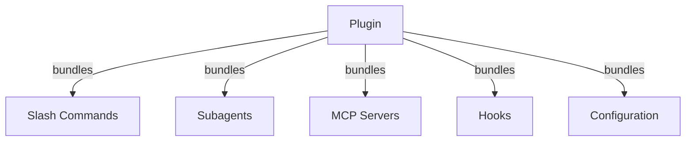

# Claude Code 教程系列：插件（Plugins）

Claude Code插件是捆绑的定制集合（斜杠命令、子代理、MCP服务器和钩子），可以通过单个命令安装。它们代表最高级别的扩展机制——将多个功能组合成连贯、可共享的包。

## 核心概念

### 什么是插件？

插件是将多个Claude Code功能捆绑成连贯、可安装的包。它们代表最高级别的扩展机制，结合了多个功能，如斜杠命令、子代理、MCP服务器和钩子。

### 插件架构



### 插件类型与分发

| 类型 | 作用域 | 共享于 | 权威 | 示例 |
|------|--------|--------|------|------|
| 官方 | 全局 | 所有用户 | Anthropic | PR Review, Security Guidance |
| 社区 | 公共 | 所有用户 | 社区 | DevOps, Data Science |
| 组织 | 内部 | 团队成员 | 公司 | 内部标准、工具 |
| 个人 | 个人 | 单一用户 | 开发者 | 自定义工作流 |

### 插件结构示例

```
my-plugin/
├── .claude-plugin/
│   └── plugin.json       # 清单（名称、描述、版本、作者）
├── commands/             # Markdown格式的技能
│   ├── task-1.md
│   ├── task-2.md
│   └── workflows/
├── agents/               # 自定义代理定义
│   ├── specialist-1.md
│   ├── specialist-2.md
│   └── configs/
├── skills/               # 带有SKILL.md文件的代理技能
│   ├── skill-1.md
│   └── skill-2.md
├── hooks/                # hooks.json中的事件处理程序
│   └── hooks.json
├── .mcp.json             # MCP服务器配置
├── .lsp.json             # LSP服务器配置，用于代码智能
├── bin/                  # 插件启用时添加到Bash工具PATH的可执行文件
├── settings.json         # 插件启用时应用的默认设置（目前仅支持`agent`键）
├── templates/
│   └── issue-template.md
├── scripts/
│   ├── helper-1.sh
│   └── helper-2.py
├── docs/
│   ├── README.md
│   └── USAGE.md
└── tests/
    └── plugin.test.js
```

### LSP服务器配置

插件可以包括语言服务器协议（LSP）支持，用于实时代码智能。LSP服务器在工作时提供诊断、代码导航和符号信息。

**配置位置：**
- 插件根目录中的`.lsp.json`文件
- `plugin.json`中的内联`lsp`键

**示例配置：**

**Go (gopls)**:
```json
{
  "go": {
    "command": "gopls",
    "args": ["serve"],
    "extensionToLanguage": {
      ".go": "go"
    }
  }
}
```

**Python (pyright)**:
```json
{
  "python": {
    "command": "pyright-langserver",
    "args": ["--stdio"],
    "extensionToLanguage": {
      ".py": "python",
      ".pyi": "python"
    }
  }
}
```

**TypeScript**:
```json
{
  "typescript": {
    "command": "typescript-language-server",
    "args": ["--stdio"],
    "extensionToLanguage": {
      ".ts": "typescript",
      ".tsx": "typescriptreact",
      ".js": "javascript",
      ".jsx": "javascriptreact"
    }
  }
}
```

**LSP功能：**

配置后，LSP服务器提供：
- **即时诊断** — 编辑后立即显示错误和警告
- **代码导航** — 跳转到定义、查找引用、实现
- **悬停信息** — 悬停时显示类型签名和文档
- **符号列表** — 浏览当前文件或工作区中的符号

## 插件选项

插件可以通过清单中的`userConfig`声明用户可配置的选项。标记为`sensitive: true`的值存储在系统密钥链中，而不是纯文本设置文件中：

```json
{
  "name": "my-plugin",
  "version": "1.0.0",
  "userConfig": {
    "apiKey": {
      "description": "服务的API密钥",
      "sensitive": true
    },
    "region": {
      "description": "部署区域",
      "default": "us-east-1"
    }
  }
}
```

## 插件设置

插件可以提供`settings.json`文件来提供默认配置。目前支持`agent`键，它设置插件的主线程代理：

```json
{
  "agent": "agents/specialist-1.md"
}
```

当插件包含`settings.json`时，其默认值在安装时应用。用户可以在自己的项目或用户配置中覆盖这些设置。

## 独立与插件方法

| 方法 | 命令名称 | 配置 | 最适合 |
|------|----------|------|--------|
| **独立** | `/hello` | 在CLAUDE.md中手动设置 | 个人、项目特定 |
| **插件** | `/plugin-name:hello` | 通过plugin.json自动 | 共享、分发、团队使用 |

对快速的个人工作流使用**独立斜杠命令**。当你想要捆绑多个功能、与团队共享或发布分发时，使用**插件**。

## 实用示例

### 示例1：PR审查插件

**文件：**`.claude-plugin/plugin.json`

```json
{
  "name": "pr-review",
  "version": "1.0.0",
  "description": "完整的PR审查工作流，包括安全性、测试和文档",
  "author": {
    "name": "Anthropic"
  },
  "repository": "https://github.com/your-org/pr-review",
  "license": "MIT"
}
```

**文件：**`commands/review-pr.md`

```markdown
---
name: Review PR
description: 启动包含安全和测试检查的全面PR审查
---

# PR审查

此命令启动完整的Pull Request审查，包括：

1. 安全分析
2. 测试覆盖率验证
3. 文档更新
4. 代码质量检查
5. 性能影响评估
```

**文件：**`agents/security-reviewer.md`

```yaml
---
name: security-reviewer
description: 专注于安全的代码审查
tools: read, grep, diff
---

# 安全审查者

专长于发现安全漏洞：
- 认证/授权问题
- 数据暴露
- 注入攻击
- 安全配置
```

**安装：**

```bash
/plugin install pr-review

# 结果：
# ✅ 3个斜杠命令已安装
# ✅ 3个子代理已配置
# ✅ 2个MCP服务器已连接
# ✅ 4个钩子已注册
# ✅ 准备使用！
```

### 示例2：DevOps插件

**组件：**

```
devops-automation/
├── commands/
│   ├── deploy.md
│   ├── rollback.md
│   ├── status.md
│   └── incident.md
├── agents/
│   ├── deployment-specialist.md
│   ├── incident-commander.md
│   └── alert-analyzer.md
├── mcp/
│   ├── github-config.json
│   ├── kubernetes-config.json
│   └── prometheus-config.json
├── hooks/
│   ├── pre-deploy.js
│   ├── post-deploy.js
│   └── on-error.js
└── scripts/
    ├── deploy.sh
    ├── rollback.sh
    └── health-check.sh
```

### 示例3：文档插件

**捆绑组件：**

```
documentation/
├── commands/
│   ├── generate-api-docs.md
│   ├── generate-readme.md
│   ├── sync-docs.md
│   └── validate-docs.md
├── agents/
│   ├── api-documenter.md
│   ├── code-commentator.md
│   └── example-generator.md
├── mcp/
│   ├── github-docs-config.json
│   └── slack-announce-config.json
└── templates/
    ├── api-endpoint.md
    ├── function-docs.md
    └── adr-template.md
```

## 插件市场

官方Anthropic管理的插件目录是`anthropics/claude-plugins-official`。企业管理员还可以为内部分发创建私有插件市场。

### 市场配置

企业和高级用户可以通过设置控制市场行为：

| 设置 | 描述 |
|------|------|
| `extraKnownMarketplaces` | 添加除默认值之外的其他市场来源 |
| `strictKnownMarketplaces` | 控制允许用户添加哪些市场 |
| `deniedPlugins` | 管理阻止列表，防止安装特定插件 |

## 插件CLI命令

所有插件操作都可用作CLI命令：

```bash
claude plugin install <name>@<marketplace>   # 从市场安装
claude plugin uninstall <name>               # 移除插件
claude plugin list                           # 列出已安装的插件
claude plugin enable <name>                  # 启用已禁用的插件
claude plugin disable <name>                 # 禁用插件
claude plugin validate                       # 验证插件结构
```

## 安装方法

### 从市场安装
```bash
/plugin install plugin-name
# 或从CLI：
claude plugin install plugin-name@marketplace-name
```

### 启用/禁用（自动检测作用域）
```bash
/plugin enable plugin-name
/plugin disable plugin-name
```

### 本地插件（用于开发）
```bash
# CLI标志用于本地测试（可重复用于多个插件）
claude --plugin-dir ./path/to/plugin
claude --plugin-dir ./plugin-a --plugin-dir ./plugin-b
```

### 从Git仓库安装
```bash
/plugin install github:username/repo
```

## 何时创建插件

| 用例 | 建议 | 原因 |
|------|------|------|
| **团队入职** | ✅ 使用插件 | 即时设置，所有配置 |
| **框架设置** | ✅ 使用插件 | 捆绑框架特定命令 |
| **企业标准** | ✅ 使用插件 | 集中分发、版本控制 |
| **快速任务自动化** | ❌ 使用命令 | 过于复杂的复杂性 |
| **单一领域专业知识** | ❌ 使用技能 | 太重，改用技能 |
| **专业分析** | ❌ 使用子代理 | 手动创建或使用技能 |
| **实时数据访问** | ❌ 使用MCP | 独立，不捆绑 |

## 测试插件

在发布之前，使用`--plugin-dir` CLI标志在本地测试你的插件（可重复用于多个插件）：

```bash
claude --plugin-dir ./my-plugin
claude --plugin-dir ./my-plugin --plugin-dir ./another-plugin
```

这会启动加载了插件的Claude Code，允许你：
- 验证所有斜杠命令都可用
- 测试子代理和代理功能正常
- 确认MCP服务器正确连接
- 验证钩子执行
- 检查LSP服务器配置
- 检查是否有任何配置错误

## 热重载

插件在开发期间支持热重载。当你修改插件文件时，Claude Code可以自动检测更改。你也可以强制重新加载：

```bash
/reload-plugins
```

这会重新读取所有插件清单、命令、代理、技能、钩子以及MCP/LSP配置，而无需重新启动会话。

## 插件安全性

插件子代理在受限的沙箱中运行。以下frontmatter键**不允许**在插件子代理定义中使用：

- `hooks` -- 子代理不能注册事件处理程序
- `mcpServers` -- 子代理不能配置MCP服务器
- `permissionMode` -- 子代理不能覆盖权限模型

这确保了插件不能提升特权或在其声明的范围之外修改主机环境。

## 发布插件

**发布步骤：**

1. 创建包含所有组件的插件结构
2. 编写`.claude-plugin/plugin.json`清单
3. 创建带文档的`README.md`
4. 使用`claude --plugin-dir ./my-plugin`在本地测试
5. 提交到插件市场
6. 获得审查和批准
7. 在市场上发布
8. 用户可以通过一个命令安装

## 最佳实践

### Do's ✅
- 使用清晰、描述性的插件名称
- 包含全面的README
- 正确地对插件进行版本控制（semver）
- 测试所有组件在一起
- 清楚地记录要求
- 提供使用示例
- 包含错误处理
- 适当标记以供发现
- 保持向后兼容
- 保持插件聚焦和连贯
- 包含全面的测试
- 记录所有依赖项

### Don'ts ❌
- 不要捆绑不相关的功能
- 不要硬编码凭据
- 不要跳过测试
- 不要忘记文档
- 不要创建冗余的插件
- 不要忽略版本控制
- 不要使组件依赖过于复杂
- 不要忘记优雅地处理错误

## 相关资源

- [Claude Code插件官方文档](https://code.claude.com/docs/en/plugins)
- [发现插件](https://code.claude.com/docs/en/discover-plugins)
- [插件市场](https://code.claude.com/docs/en/plugin-marketplaces)
- [MCP服务器参考](https://modelcontextprotocol.io/)
- [子代理配置指南](../claude-howto/04-subagents/)
- [钩子系统参考](../claude-howto/06-hooks/)

---
这是[Claude Code 教程系列](../claude-howto/)的第七篇文章。下一篇文章将介绍Claude Code的检查点与回溯功能。