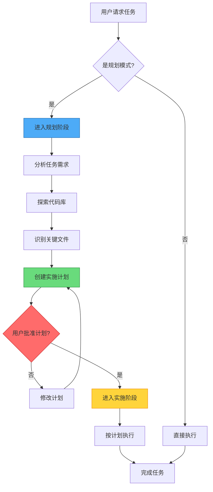

高级功能扩展了Claude Code的核心能力，包括规划、推理、自动化和控制机制。这些功能为复杂的开发任务、代码审查、自动化和多会话管理提供了复杂的工作流程。

## 核心概念

### 主要高级功能

- **规划模式（Planning Mode）**：在编码之前创建详细的实施计划
- **扩展思考（Extended Thinking）**：对复杂问题进行深度推理
- **自动模式（Auto Mode）**：后台安全分类器在执行前审查每个操作
- **后台任务（Background Tasks）**：运行长时间操作而不阻塞对话
- **权限模式（Permission Modes）**：控制Claude可以做什么
- **无头模式（Headless Mode）**：非交互模式，用于自动化和CI/CD
- **会话管理**：管理工作会话
- **交互功能**：键盘快捷键、多行输入、命令历史


*图：Claude Code的主要高级功能，包括规划模式、扩展思考、自动模式、后台任务等。*

## 规划模式

### 什么是规划模式？

规划模式是一种两阶段方法：
1. **规划阶段**：Claude分析任务并创建详细的实施计划
2. **实施阶段**：批准后，Claude执行计划

### 激活规划模式

**斜杠命令：**
```bash
/plan 实现用户认证系统
```

**CLI标志：**
```bash
claude --permission-mode plan
```

**设置为默认：**
```json
{
  "permissions": {
    "defaultMode": "plan"
  }
}
```

**键盘快捷键：**
- `Shift + Tab` - 切换权限模式（包括plan）
- `Alt + M` - 切换权限模式（Windows/Linux）

### 规划模式的好处

- **结构化实施方法**：详细分解实施步骤
- **审查和批准**：执行前批准或调整计划
- **风险识别**：实施前识别潜在问题
- **清晰的阶段**：有组织的实施阶段和里程碑

## 规划模式工作流

规划模式采用两阶段方法，先规划后实施：



## 扩展思考

### 什么是扩展思考？

扩展思考是一种深思熟虑的分步推理过程，Claude：
- 分解复杂问题
- 考虑多种方法
- 评估权衡
- 推理边缘情况

### 激活扩展思考

**键盘快捷键：**
- `Option + T` (macOS) / `Alt + T` (Windows/Linux) - 切换扩展思考

**自动激活：**
- 默认对所有模型启用（Opus 4.7、Sonnet 4.6、Haiku 4.5）
- Opus 4.7：自适应推理与努力级别：`low` (○)、`medium` (◐)、`high` (●)、`xhigh`（Opus 4.7的新默认值）、`max`（仅Opus 4.7）

**环境变量：**
```bash
export MAX_THINKING_TOKENS=1024
```

**努力级别**（仅Opus 4.7）：
```bash
export CLAUDE_CODE_EFFORT_LEVEL=xhigh   # low, medium, high, xhigh（Opus 4.7上的默认值），或max（仅Opus 4.7）
```

## 自动模式

自动模式是一个研究预览权限模式，它使用后台安全分类器在执行前审查每个操作。

### 要求

- **计划**：Team、Enterprise或API计划（Pro或Max计划不可用）
- **模型**：Claude Sonnet 4.6或Opus 4.7
- **提供商**：仅Anthropic API（Bedrock、Vertex或Foundry不支持）
- **分类器**：在Claude Sonnet 4.6上运行（增加额外的token成本）

### 启用自动模式

```bash
# 使用CLI标志解锁自动模式
claude --enable-auto-mode

# 然后在REPL中使用Shift+Tab循环到它
```

或者将其设置为默认权限模式：

```bash
claude --permission-mode auto
```

### 默认阻止的操作

自动模式默认阻止以下操作：

| 阻止的操作 | 示例 |
|------------|------|
| Pipe到shell安装 | `curl \| bash` |
| 向外发送敏感数据 | 通过网络发送API密钥、凭据 |
| 生产部署 | 针对生产环境的部署命令 |
| 大规模删除 | 在大目录上的`rm -rf` |
| IAM更改 | 权限和角色修改 |
| 强制推送到main | `git push --force origin main` |

## 后台任务

后台任务允许长时间运行的操作在不阻塞对话的情况下执行。

### 什么是后台任务？

后台任务异步运行，而你可以继续工作：
- 长测试套件
- 构建过程
- 数据库迁移
- 部署脚本
- 分析工具

### 基本使用

```bash
用户：在后台运行测试

Claude：启动任务bg-1234

/task list           # 显示所有任务
/task status bg-1234 # 检查进度
/task show bg-1234   # 查看输出
/task cancel bg-1234 # 取消任务
```

### 管理后台任务

**列出活动任务：**
```
用户：/task list

活动后台任务：
1. [bg-1234] 运行测试（完成50%，剩余2分钟）
2. [bg-1235] 构建Docker镜像（完成25%，剩余8分钟）
3. [bg-1236] 部署到staging（完成90%，剩余30秒）
```

## 权限模式

权限模式控制Claude可以在没有明确批准的情况下执行哪些操作。

### 可用的权限模式

| 模式 | 行为 |
|------|------|
| `default` | 只读文件；所有其他操作都会提示 |
| `acceptEdits` | 读取和编辑文件；命令需要提示 |
| `plan` | 只读文件（研究模式，无编辑） |
| `auto` | 所有操作都有后台安全分类器检查（研究预览） |
| `bypassPermissions` | 所有操作，无权限检查（危险） |
| `dontAsk` | 只有预先批准的工具执行；所有其他都被拒绝 |

使用`Shift+Tab`在CLI中循环模式。使用`--permission-mode`标志或`permissions.defaultMode`设置设置默认值。


*图：六种权限模式及其使用场景，从最安全的default到最危险的bypassPermissions。*

### 激活方法

**键盘快捷键：**
```bash
Shift + Tab  # 循环所有6种模式
```

**斜杠命令：**
```bash
/plan                  # 进入规划模式
```

**CLI标志：**
```bash
claude --permission-mode plan
claude --permission-mode auto
```

## 无头模式

打印模式（`claude -p`）允许Claude Code在没有交互输入的情况下运行，非常适合自动化和CI/CD。

### 运行打印模式（非交互）

```bash
# 运行特定任务
claude -p "运行所有测试"

# 处理管道内容
cat error.log | claude -p "分析这些错误"

# CI/CD集成（GitHub Actions）
- name: AI代码审查
  run: claude -p "审查PR"
```

### CI/CD集成示例

**GitHub Actions：**
```yaml
# .github/workflows/code-review.yml
name: AI代码审查

on: [pull_request]

jobs:
  review:
    runs-on: ubuntu-latest
    steps:
      - uses: actions/checkout@v4

      - name: 安装Claude Code
        run: npm install -g @anthropic-ai/claude-code

      - name: 运行Claude代码审查
        env:
          ANTHROPIC_API_KEY: ${{ secrets.ANTHROPIC_API_KEY }}
        run: |
          claude -p --output-format json \
            --max-turns 3 \
            "审查此PR的以下方面：
            - 代码质量问题
            - 安全漏洞
            - 性能问题
            - 测试覆盖率
            输出结果为JSON" > review.json

      - name: 发布审查评论
        uses: actions/github-script@v7
        with:
          script: |
            const fs = require('fs');
            const review = JSON.parse(fs.readFileSync('review.json', 'utf8'));
            github.rest.issues.createComment({
              issue_number: context.issue.number,
              owner: context.repo.owner,
              repo: context.repo.repo,
              body: JSON.stringify(review, null, 2)
            });
```

## 会话管理

有效地管理多个Claude Code会话。

### 会话管理命令

| 命令 | 描述 |
|------|------|
| `/resume` | 按ID或名称恢复对话 |
| `/rename` | 命名当前会话 |
| `/fork` | 将当前会话分支到新分支 |
| `claude -c` | 继续最近的对话 |
| `claude -r "session"` | 按名称或ID恢复会话 |

### 恢复会话

**继续上次对话：**
```bash
claude -c
```

**按名称恢复会话：**
```bash
claude -r "auth-refactor" "完成此PR"
```

**重命名当前会话**（在REPL内）：
```
/rename auth-refactor
```

### 分支会话

将会话分支以尝试替代方法而不丢失原始会话：

```
/fork
```

或从CLI：
```bash
claude --resume auth-refactor --fork-session "尝试OAuth"
```

## 交互功能

### 键盘快捷键

| 快捷键 | 描述 |
|--------|------|
| `Ctrl+C` | 取消当前输入/生成 |
| `Ctrl+D` | 退出Claude Code |
| `Ctrl+G` | 在外部编辑器中编辑计划 |
| `Ctrl+L` | 清除终端屏幕 |
| `Ctrl+O` | 切换详细输出（查看推理） |
| `Ctrl+R` | 反向搜索历史 |
| `Ctrl+T` | 切换任务列表视图 |
| `Ctrl+B` | 后台运行任务 |
| `Esc+Esc` | 回溯代码/对话 |
| `Shift+Tab` / `Alt+M` | 切换权限模式 |
| `Option+P` / `Alt+P` | 切换模型 |
| `Option+T` / `Alt+T` | 切换扩展思考 |

### 自定义键绑定

运行`/keybindings`以编辑`~/.claude/keybindings.json`：

```json
{
  "$schema": "https://www.schemastore.org/claude-code-keybindings.json",
  "bindings": [
    {
      "context": "Chat",
      "bindings": {
        "ctrl+e": "chat:externalEditor",
        "ctrl+u": null,
        "ctrl+k ctrl+s": "chat:stash"
      }
    }
  ]
}
```

将绑定设置为`null`以取消默认快捷键。

### Vim模式

启用Vi/Vim键绑定进行文本编辑：

**激活：**
- 使用`/vim`命令或`/config`启用
- 使用`Esc`切换NORMAL，`i/a/o`切换INSERT

## 语音听写

语音听写提供按住说话的语音输入，让你可以说出提示而不是输入。

### 激活语音听写

```
/voice
```

### 特性

| 特性 | 描述 |
|------|------|
| **按住说话** | 按住键录制，释放以发送 |
| **20种语言** | 语音转文字支持20种语言 |
| **自定义键绑定** | 通过`/keybindings`配置按住说话键 |
| **账户要求** | 需要Claude.ai账户进行STT处理 |

## 远程控制

远程控制让你可以从手机、平板或任何浏览器继续本地运行的Claude Code会话。你的本地会话在你的机器上保持运行——没有任何内容移动到云端。

### 启动远程控制

**从CLI：**

```bash
# 使用默认会话名称启动
claude remote-control

# 使用自定义名称启动
claude remote-control --name "Auth Refactor"
```

**在会话内：**

```
/remote-control
/remote-control "Auth Refactor"
```

### 连接到会话

从另一台设备连接的三种方式：

1. **会话URL** — 会话开始时打印到终端；在任何浏览器中打开
2. **二维码** — 启动后按空格键显示可扫描的二维码
3. **按名称查找** — 在claude.ai/code或Claude移动应用（iOS/Android）中浏览你的会话

### 远程控制与Claude Code on the Web

| 方面 | 远程控制 | Claude Code on Web |
|------|---------------|-------------------|
| **执行** | 在你的机器上运行 | 在Anthropic云上运行 |
| **本地工具** | 完全访问本地MCP服务器、文件和CLI | 无本地依赖 |
| **用例** | 从另一台设备继续本地工作 | 从任何浏览器开始新工作 |

## 最佳实践

### 规划模式
- ✅ 用于复杂的多步骤任务
- ✅ 在批准前审查计划
- ✅ 根据需要修改计划
- ❌ 不要用于简单任务

### 扩展思考
- ✅ 用于架构决策
- ✅ 用于复杂问题解决
- ✅ 审查思考过程
- ❌ 不要用于简单查询

### 后台任务
- ✅ 用于长时间运行的操作
- ✅ 监控任务进度
- ✅ 优雅地处理任务失败
- ❌ 不要启动太多并发任务

### 权限
- ✅ 使用`plan`进行代码审查（只读）
- ✅ 使用`default`进行交互式开发
- ✅ 使用`acceptEdits`进行自动化工作流
- ✅ 使用`auto`进行带安全护栏的自主工作
- ❌ 除非绝对必要，否则不要使用`bypassPermissions`

### 会话
- ✅ 为不同任务使用单独的会话
- ✅ 保存重要的会话状态
- ✅ 清理旧会话
- ❌ 不要在一个会话中混合不相关的工作

## 相关资源

- [Claude Code官方交互模式文档](https://code.claude.com/docs/en/interactive-mode)
- [检查点指南](../claude-howto/08-checkpoints/) - 会话管理和回溯
- [CLI参考](https://code.claude.com/docs/en/cli-reference)
- [斜杠命令](../claude-howto/01-slash-commands/) - 命令参考
- [内存指南](../claude-howto/02-memory/) - 持久化上下文
- [技能指南](../claude-howto/03-skills/) - 自主能力
- [子代理指南](../claude-howto/04-subagents/) - 委托任务执行

---
这是[Claude Code 教程系列](../claude-howto/)的第九篇文章。下一篇文章将介绍Claude Code的CLI参考。