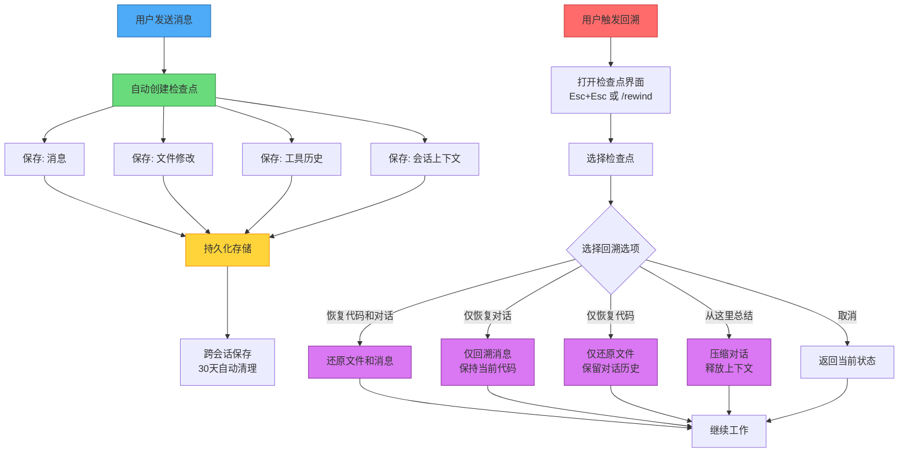

检查点允许你保存对话状态并回溯到之前的点。这对于探索不同的方法、从错误中恢复或比较替代方案非常有用。

<!--more-->

## 核心概念

### 什么是检查点？

检查点保存对话状态，包括：

- 所有交换的消息
- 对文件所做的修改
- 工具使用历史
- 会话上下文

检查点对于探索不同的方法、从错误中恢复或比较替代方案非常有价值。


*图：检查点系统的数据流和存储架构，展示从用户交互到持久化存储的完整流程。*

### 访问检查点

你可以通过两种主要方式访问和管理检查点：

#### 使用键盘快捷键

按两次 `Esc`（`Esc` + `Esc`）打开检查点界面并浏览保存的检查点。

#### 使用斜杠命令

使用 `/rewind`命令（别名：`/checkpoint`）进行快速访问：

```bash
# 打开回溯界面
/rewind

# 或使用别名
/checkpoint
```

### 回溯选项

当你回溯时，你会看到一个包含五个选项的菜单：

1. **恢复代码和对话** -- 将文件和消息都还原到该检查点
2. **仅恢复对话** -- 仅回溯消息，保持当前代码不变
3. **仅恢复代码** -- 仅还原文件更改，保留完整的对话历史
4. **从这里总结** -- 从该点开始压缩对话，释放上下文窗口空间。选定点之前的消息保持完整。不更改磁盘上的文件。原始消息保留在会话记录中。你可以选择性地提供说明以将总结聚焦于特定主题。
5. **算了** -- 取消并返回当前状态

> **注意**：恢复对话或总结后，所选消息的原始提示词会恢复到输入字段中，以便你可以重新发送或编辑。


*图：五种回溯选项及其效果，选择不同的选项会产生不同的恢复行为。*

### 自动检查点

claude code自动为你创建检查点：

- **每个用户提示** - 每次用户输入都会创建一个新的检查点
- **持久化** - 检查点跨会话持久化
- **自动清理** - 检查点在30天后自动清理

这意味着你总是可以回溯到对话中之前的任何一点，从几分钟前到几天前。

## 使用场景

| 场景               | 工作流                                         |
| ------------------ | ---------------------------------------------- |
| **探索方法** | 保存 → 尝试A → 保存 → 回溯 → 尝试B → 比较 |
| **安全重构** | 保存 → 重构 → 测试 → 如果失败：回溯         |
| **A/B测试**  | 保存 → 设计A → 保存 → 回溯 → 设计B → 比较 |
| **错误恢复** | 注意到问题 → 回溯到最后一个良好状态           |

## 工作流模式

### 探索的分支策略

当探索多种方法时：

```
1. 初始实现 → 检查点A
2. 尝试方法1 → 检查点B
3. 回溯到检查点A
4. 尝试方法2 → 检查点C
5. 比较B和C的结果
6. 选择最佳方法并继续
```

### 安全重构模式

进行重大更改时：

```
1. 当前状态 → 检查点（自动）
2. 开始重构
3. 运行测试
4. 如果测试通过 → 继续工作
5. 如果测试失败 → 回溯并尝试不同的方法
```

## 检查点回溯流程

检查点的创建和使用流程如下：



## 配置

检查点是claude code中默认启用的内置行为，不需要任何配置即可启用。每个用户提示会自动创建检查点。

与检查点相关的唯一设置是 `cleanupPeriodDays`，它控制会话和检查点保留的时间：

```json
{
  "cleanupPeriodDays": 30
}
```

`cleanupPeriodDays`：保留会话历史和检查点的天数（默认：`30`）

## 限制

检查点具有以下限制：

- **Bash命令更改不跟踪** - 文件系统上的 `rm`、`mv`、`cp`等操作不捕获在检查点中
- **外部更改不跟踪** - 在claude code之外所做的更改（在你的编辑器、终端等）不捕获
- **不是版本控制的替代品** - 使用git进行永久、可审计的代码库更改

## 最佳实践

### 有效使用检查点

✅ **Do:**

- 回溯前审查可用的检查点
- 当你想探索不同的方向时使用回溯
- 保留检查点以比较不同的方法
- 理解每个回溯选项的作用（恢复代码和对话、恢复对话、恢复代码或总结）

❌ **Don't:**

- 仅依赖检查点进行代码保留
- 期望检查点跟踪外部文件系统更改
- 使用检查点作为git的替代品

## 参考链接

[claude-howto](https://github.com/luongnv89/claude-howto)
