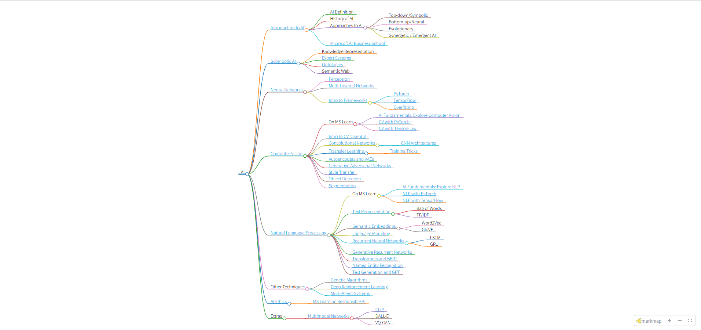

## Mindmap



## Course Setup

All steps is done on Debian 12. If you use a win11 system like me, just try to install Debian12 by WSL2.(About WSL2,goole yourself,It's quiet easy).

1. clone whole project to your local machine

```
git clone https://github.com/microsoft/AI-For-Beginners.git
```

2. install npm

```
sudo apt update
sudo apt install npm
```

3. install Docsify, and start service on your local machine.After that,you can visit the course on this url: 
http://localhost:3000/etc/pdf/readme.pdf. By the way, you can also download the whole cource and reserve it in .pdf format.

```
npm i docsify-cli -g
docsify-serve
```
