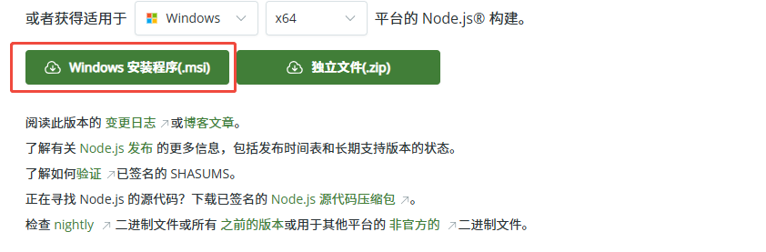
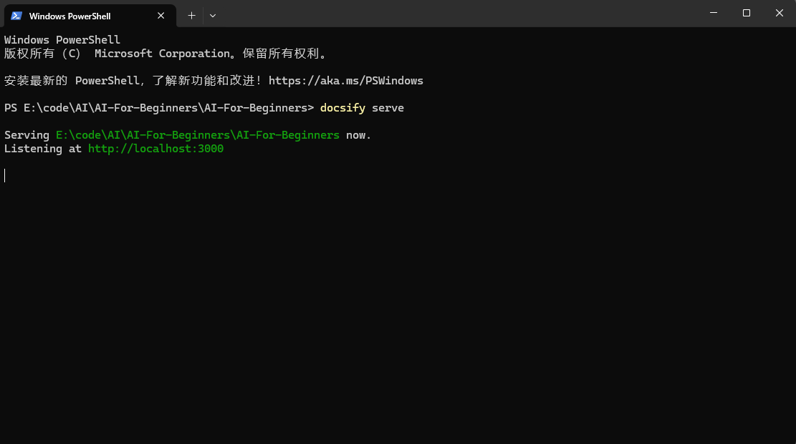

## AI知识图谱

## Course Setup

1、从github克隆完整项目到本地

`git clone https://github.com/microsoft/AI-For-Beginners.git`

2、下载并安装nodejs（链接：https://nodejs.org/zh-cn/download/）

3、安装Docsify，win + R打开cmd，执行
`npm i docsify-cli -g`

4、在AI-For-Beginners根目录下执行

`docsify serve`

5、打开浏览器，输入http://localhost:3000/etc/pdf/readme.pdf，就可以浏览课程了
