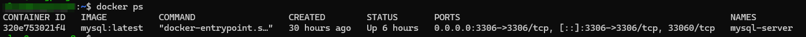
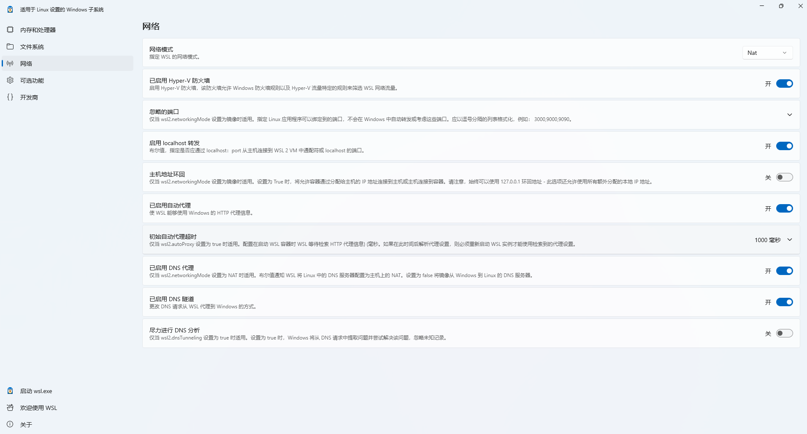
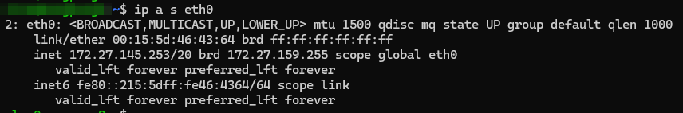

## prerequisite

**Host OS:** windows11

**Virtual Platform:** WSL2

**Linux Release:** debian 12

**Docker**:  Docker Engine - Community 28.0.1

## deploy mysql server

1. config docker registry first (if docker.io is not accessible for you)

```
# edit config file /etc/docker/daemon.json, write follow code
{
  "registry-mirrors": [
     "https://docker.xuanyuan.me"
  ]
}
```

2. start docker service

`sudo service docker start`

3. install mysql with docker

`docker pull mysql:latest`

4. then start mysql server, setup MYSQL_ROOT_PASSWORD to pswd1234 (or any other password you like)

`docker run -d --name mysql-server -p 3306:3306 -e MYSQL_ROOT_PASSWORD=pswd1234 --restart=always mysql:latest --bind-address=0.0.0.0`

5. check anything is ok, run docker ps, you will see something like this



6. create user account and database

```
# connect to mysql server
docker exec -it mysql-server mysql -u root -p

# create database 'test'
CREATE DATABASE test;

# create user 'alan' with password 'alan'
CREATE USER 'alan'@'%' IDENTIFIED BY 'alan';

# grant all provileges to user 'alan'
GRANT ALL PRIVILEGES ON test.* TO 'alan'@'%';
FLUSH PRIVILEGES;

# accept remote access
ALTER USER 'alan'@'%' IDENTIFIED WITH mysql_native_password BY 'alan';
FLUSH PRIVILEGES;
```

## config host network to enable remote access

1. check wsl setting on windows 11



2. check ip of debian 12, run `ip a s eth0`:



3. setup port forwarding rules on windows11, run powershell with administrator privilege:

```
# setup port forwarding
netsh interface portproxy add v4tov4 listenport=3306 listenaddress=0.0.0.0 connectport=3306 connectaddress=<eth0-ip>

# setup firewall rules, open tcp port 3306
New-NetFirewallRule -DisplayName "Allow MySQL Port 3306" -Direction Inbound -Protocol TCP -LocalPort 3306 -Action Allow
```
