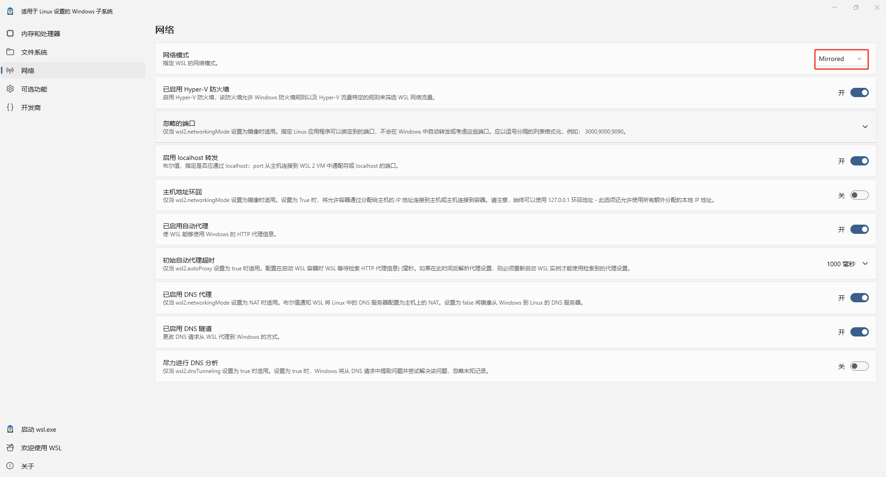

## 操作系统版本

| Host OS    | Virtual Platform | Linux Release | Docker                         |
| ---------- | ---------------- | ------------- | ------------------------------ |
| windows 11 | WSL2             | debian 12     | Docker Engine-Community 28.0.1 |

## docker部署mysql服务

1. 配置docker镜像源

```bash
sudo tee /etc/docker/daemon.json > /dev/null << 'EOF'
{
  "registry-mirrors": [
     "https://docker.xuanyuan.me"
  ]
}
EOF
```

2. 部署mysql服务

```bash
# 启动docker
sudo service docker start
# 拉取mysql镜像
docker pull mysql:latest
# 启动mysql服务，root密码设置为pswd1234
docker run -d --name mysql-server -p 3306:3306 -e MYSQL_ROOT_PASSWORD=pswd1234 --restart=always mysql:latest --bind-address=0.0.0.0
```

3. 配置mysql

```bash
# root用户登录，密码pswd1234
docker exec -it mysql-server mysql -u root -p
# 创建数据库
CREATE DATABASE test;
# 创建用户alan，密码alan
CREATE USER 'alan'@'%' IDENTIFIED BY 'alan';
# 设置用户权限
GRANT ALL PRIVILEGES ON test.* TO 'alan'@'%';
# 设置远程访问认证方式
ALTER USER 'alan'@'%' IDENTIFIED WITH mysql_native_password BY 'alan';
# 结束设置
FLUSH PRIVILEGES;
```

## 配置WSL网络

1、打开WSL settings->网络，确认当前网络模式是否是镜像模式（Mirrored)，若不是，切换至镜像模式。



NAT模式也可以支持远程访问，前提是要配置端口转发策略，镜像模式更简单。


2、如果1中修改了网络模式，需要重启WSL使其生效，管理员身份打开powershell，执行：
```bash
# 关闭wsl
wsl --shutdown
# 启动wsl
wsl
# 设置host防火墙策略，放行3306端口
New-NetFirewallRule -DisplayName "Allow Mysql Port 3306" -Direction Inbound -Protocol TCP -LocalPort 3306 -Action Allow
```
