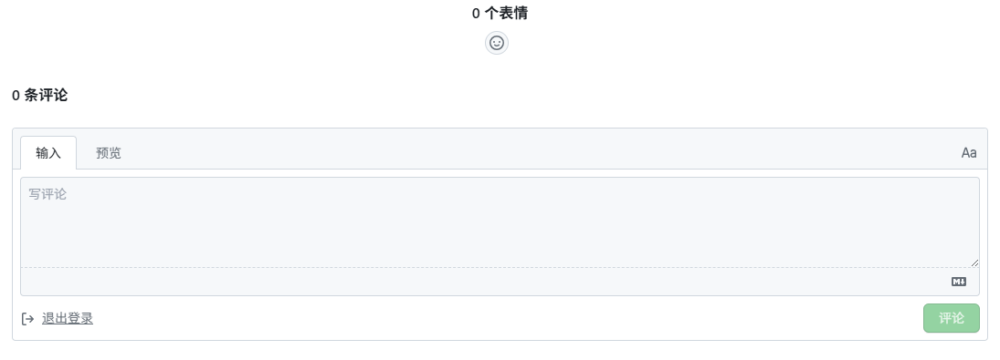
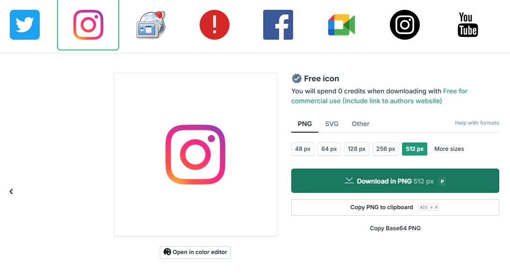

## 接入giscus评论系统

原生的disqus评论系统广告充斥？与其花时间研究如何屏蔽，不如直接切换到giscus，网站瞬间变得清爽，照链接操作几分钟内轻松搞定 
[giscus](https://giscus.app/zh-CN)

## 资源列表

### 网站logo

不想被各种版权问题折磨，无需注册，快速获取心怡的网站logo 
[Free icons - Iconfinder](https://www.iconfinder.com/search?price=free)

### 图片背景去除

在线去除图片背景，无需注册，不带水印
[在线抠图软件_图片去除背景 | remove.bg – remove.bg](https://www.remove.bg/zh)

